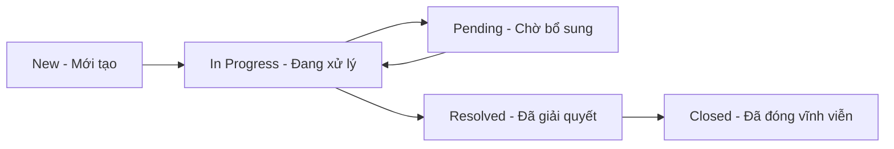

# NGHIỆP VỤ CỐT LÕI (DOMAIN KNOWLEDGE) - UNISUPPORT

> **Dự án:** UniSupport — Nền tảng Hỗ trợ Thủ tục Hành chính Sinh viên  
> **Thư mục:** `docs/domain/`  
> **Vai trò:** Tài liệu kiến thức nền tảng về bối cảnh, mô hình dữ liệu Ticket, quy tắc nghiệp vụ (Business Rules) và luồng trạng thái cốt lõi của hệ thống.

---

## 1. Bản đồ Tài liệu Nghiệp vụ (Domain Documentation Index)

| File Tài liệu | Tiêu đề chính | Nội dung tóm tắt |
| :--- | :--- | :--- |
| **[tong-quan-domain.md](tong-quan-domain.md)** | Đề xuất Giải pháp Single Service Desk | Bối cảnh, vấn đề cốt lõi, giải pháp một cửa số hóa và các đối tượng sử dụng (Actors: Sinh viên, Nhân viên, Quản lý, Admin). |
| **[quy-tac-nghiep-vu.md](quy-tac-nghiep-vu.md)** | Quy tắc Nghiệp vụ & Ràng buộc Hệ thống | Các quy tắc cốt lõi về phân quyền RBAC, điều kiện chỉnh sửa Ticket, cơ chế Pending 72h, kiểm soát kết quả giải quyết và định tuyến danh mục "Khác". |
| **[chuyen-doi-trang-thai.md](chuyen-doi-trang-thai.md)** | Quy định Luồng Trạng thái Ticket | Vòng đời 5 trạng thái Ticket (`New` $\rightarrow$ `In Progress` $\rightarrow$ `Pending` $\rightarrow$ `Resolved` $\rightarrow$ `Closed`), ma trận chuyển đổi và các quy tắc tự động hóa. |
| **[mo-hinh-ticket.md](mo-hinh-ticket.md)** | Cấu trúc Dữ liệu Yêu cầu (Ticket Data Model) | Định dạng mã Ticket (`[CATEGORY_CODE]-[YYYYMMDD]-[SEQ_NUMBER]`), các thuộc tính dữ liệu cơ bản, trạng thái, timestamps và Resolution Notes. |

---

## 2. Tổng quan Mô hình Vòng đời Ticket 5 Trạng thái

---

## 3. Các Quy tắc Nghiệp vụ Cốt lõi (Key Principles)

1. **Cơ chế Hệ thống Đóng:** Tài khoản do nhà trường cấp sẵn; Sinh viên và Nhân viên đăng nhập bằng mã định danh cá nhân, tuyệt đối không có chức năng đăng ký tự do.
2. **Khóa thao tác khi Đang xử lý:** Sinh viên chỉ được sửa thông tin Ticket khi ở trạng thái `New` hoặc khi Nhân viên yêu cầu ở trạng thái `Pending`.
3. **Chống đếm ngược / Đơn treo (Pending 72h):** Trạng thái `Pending` đếm ngược tối đa 72 giờ; hết 72h sinh viên không bổ sung thông tin sẽ tự động xử lý/đóng đơn.
4. **Ép buộc Nhập kết quả (Resolution Notes):** Khi Nhân viên chuyển đơn sang `Resolved`, hệ thống bắt buộc nhập nội dung giải trình kết quả trước khi lưu.
5. **Đóng vĩnh viễn (No Reopen):** Đơn chuyển sang `Closed` sau khi Sinh viên đánh giá sao (1–5) hoặc tự động đóng sau 72h sẽ bị khóa cứng trên Database, tuyệt đối không cho phép mở lại.
