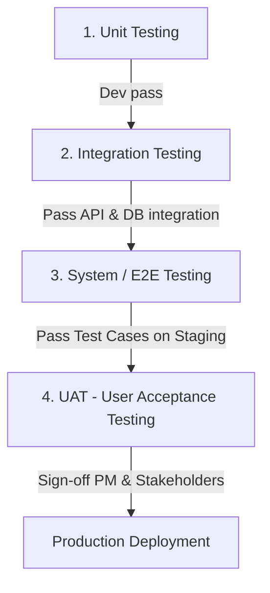

# KẾ HOẠCH & CHIẾN LƯỢC KIỂM THỬ (TEST STRATEGY & PLAN) - UNISUPPORT

---

## 1. Mục Tiêu & Phạm Vi Kiểm Thử (Testing Scope)

Tài liệu này định nghĩa chiến lược kiểm thử chất lượng phần mềm cho hệ thống **UniSupport**, đảm bảo phần mềm đáp ứng 100% các tiêu chí nghiệm thu (`Acceptance Criteria - AC`) và quy tắc nghiệp vụ (`Business Rules - BR`) được ghi nhận trong bộ PRD.

### Phạm vi Kiểm thử:
* **Tính năng chức năng (Functional Testing):** 10 Phân hệ chức năng và 9 Luồng quy trình (Workflows).
* **Kiểm thử Bảo mật (Security & Access Control):** Kiểm tra phân quyền RBAC, cơ chế khóa tài khoản khi bruteforce, bảo mật API token.
* **Kiểm thử Luồng dữ liệu & Toàn vẹn (Data Integrity):** Ràng buộc không cho reopening Ticket `CLOSED`, bắt buộc `Resolution Notes` khi `RESOLVED`.
* **Kiểm thử Giao diện & Trải nghiệm (UI/UX & Compatibility):** Responsive trên Chrome, Safari, Firefox, Edge và thiết bị di động.

---

## 2. Cấp Độ Kiểm Thử (Testing Levels)

1. **Unit Testing (Kiểm thử mức Đơn vị):** Do Developers thực hiện, bao phủ các hàm tính toán, định tuyến ticket, mã hóa mật khẩu và validate dữ liệu đầu vào.
2. **Integration Testing (Kiểm thử Tích hợp):** Kiểm tra giao tiếp API между Frontend - Backend và kết nối Cơ sở dữ liệu/Redis.
3. **System / End-to-End Testing (Kiểm thử Hệ thống):** Do Đội ngũ QA/QC thực hiện trên môi trường **Staging**, chạy toàn bộ kịch bản luồng nghiệp vụ từ khởi tạo đến đóng ticket.
4. **UAT (Nghệ m thu Người dùng cuối):** Demo thực tế cho Ban quản lý và đại diện sinh viên/cán bộ nhà trường nghiệm thu.

---

## 3. Phân Loại Bug & Ma Trận Mức Độ Ưu Tiên (Bug Severity Matrix)

| Mức độ Lỗi (Severity) | Mô tả & Ví dụ | SLA Fixbug |
| :--- | :--- | :--- |
| **Critical (Nghiêm trọng)** | Hệ thống sập (Crash), không thể đăng nhập, rò rỉ dữ liệu, sai lệch trạng thái làm mất đơn. | Fix ngay trong $2 - 4\text{h}$ |
| **High (Cao)** | Tính năng cốt lõi lỗi (không thể gửi ticket, không thể Claim đơn, không lưu được kết quả xử lý). | Fix trong vòng $24\text{h}$ |
| **Medium (Trung bình)** | Lỗi giao diện, thông báo lỗi hiển thị không rõ ràng, lọc tìm kiếm chưa chính xác nhưng có luồng thay thế. | Fix trong Sprint hiện tại |
| **Low (Thấp)** | Lỗi chính tả, lệch pixel giao diện nhẹ, định dạng ngày tháng chưa tối ưu. | Đưa vào backlog xử lý sau |

---

## 4. Tiêu Chí Vào/Ra (Entry & Exit Criteria)

### 4.1 Entry Criteria (Điều kiện bắt đầu Kiểm thử Staging)
* Code đã trôi qua Code Review của Senior Developer.
* Deploy thành công lên môi trường Staging không có lỗi build.
* 100% API chính đã pass Unit Test sơ bộ.

### 4.2 Exit Criteria (Điều kiện nghiệm thu & Deploy Production)
* 100% Test Cases ưu tiên High/Critical được thực thi.
* **Không còn Bug ở mức Critical hoặc High chưa xử lý.**
* Bộ tài liệu kỹ thuật và hướng dẫn sử dụng được cập nhật hoàn chỉnh.
