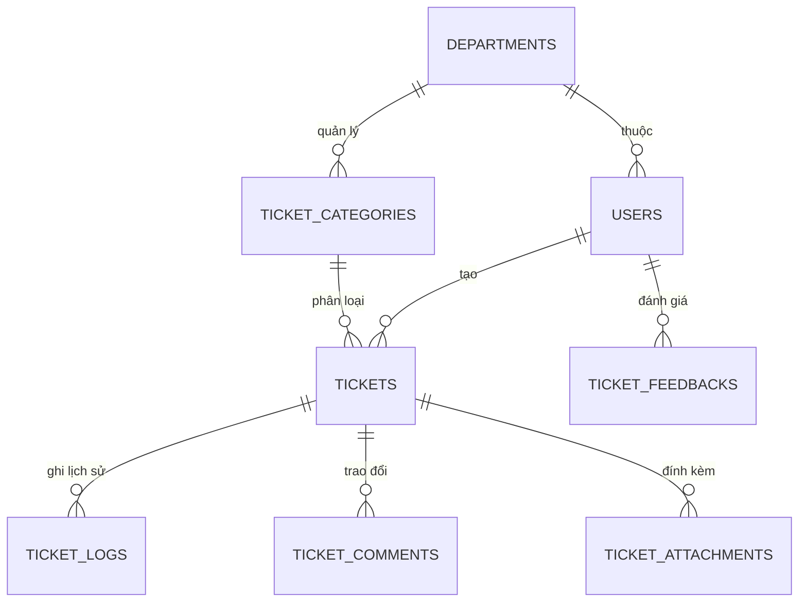

# THIẾT KẾ CƠ SỞ DỮ LIỆU (DATABASE ERD) — UNISUPPORT

> **Dự án:** UniSupport — System Helpdesk & Support  
> **Phạm vi:** Mô hình ERD, cấu trúc bảng, các ràng buộc và chỉ mục (Indexes).

---

## 1. Sơ đồ Quan hệ Thực thể (Mermaid ERD)

---

## 2. Danh mục Bảng CSDL cốt lõi
1. **`users`** — Người dùng (Sinh viên, Nhân viên, Quản lý, Admin)
2. **`departments`** — Phòng ban hỗ trợ
3. **`categories`** — Danh mục dịch vụ thủ tục hành chính
4. **`tickets`** — Yêu cầu hỗ trợ (Ticket)
5. **`ticket_logs`** — Lịch sử chuyển trạng thái
6. **`ticket_comments`** — Trao đổi nội bộ & với sinh viên
7. **`ticket_attachments`** — Tài liệu đính kèm
8. **`ticket_feedbacks`** — Đánh giá CSAT 1–5 sao
