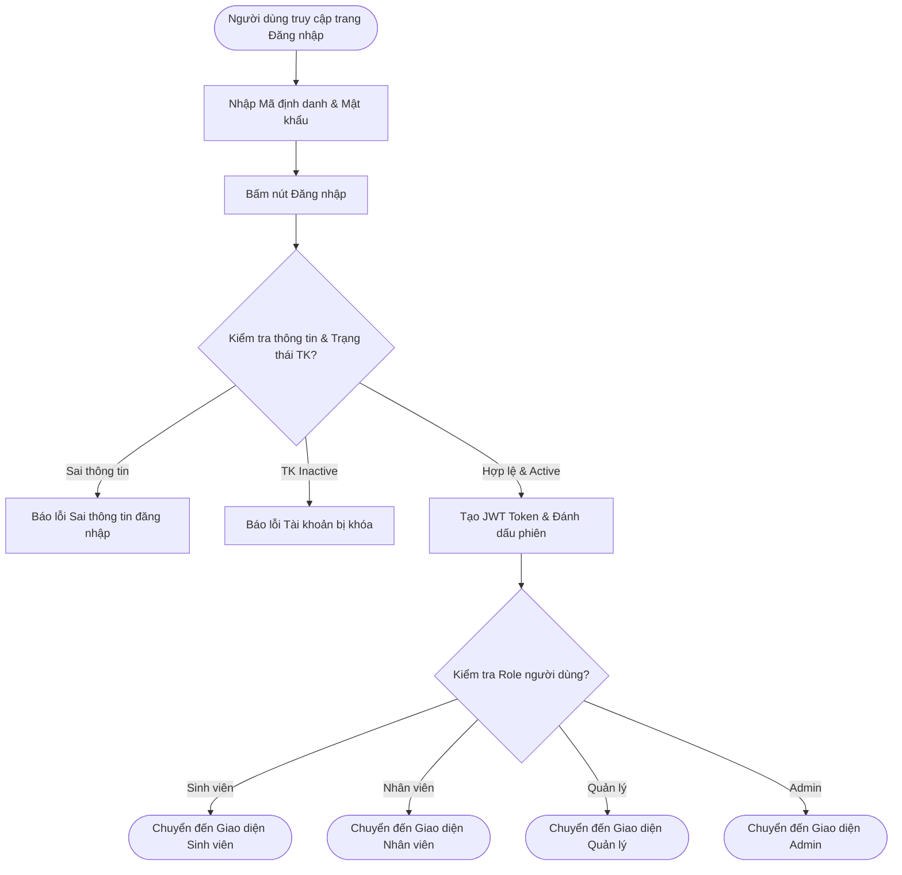
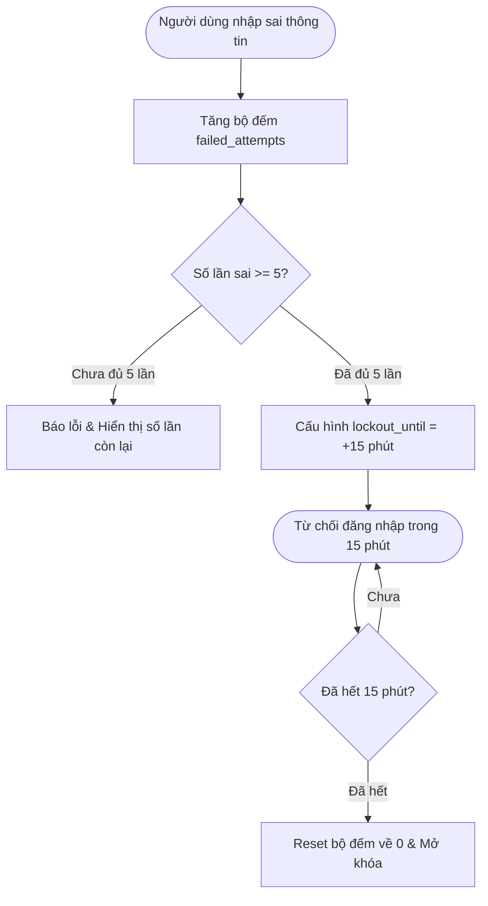
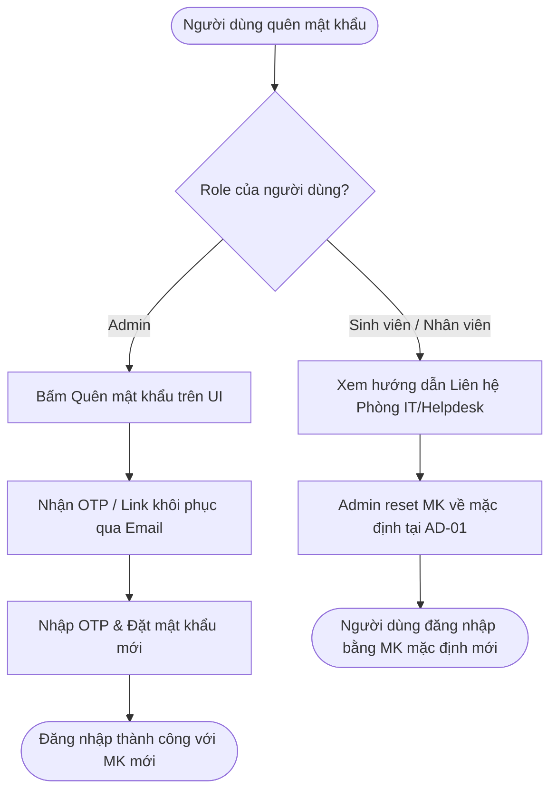
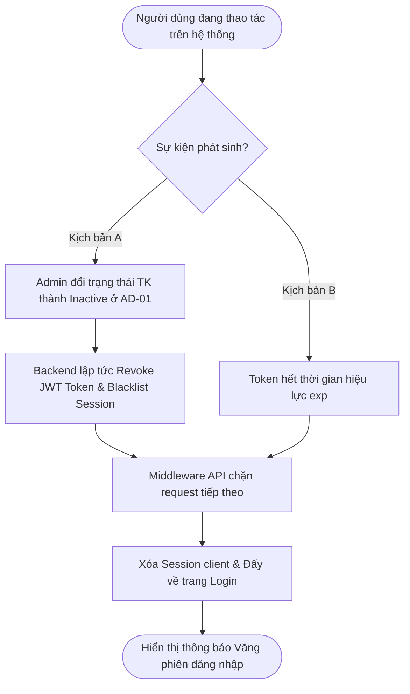

# 0. QUY TRÌNH CHUNG — ĐĂNG NHẬP, XÁC THỰC & PHIÊN LÀM VIỆC (AUTHENTICATION & SESSION WORKFLOWS)

> **Ánh xạ Phân hệ:** [M01-dang-nhap-xac-thuc](../modules/GĐ1-NenTang&ChucNangCotLoi/M01-dang-nhap-xac-thuc/), [M02-vai-tro-phan-quyen](../modules/GĐ1-NenTang&ChucNangCotLoi/M02-vai-tro-phan-quyen/), [M03-quan-ly-tai-khoan](../modules/GĐ1-NenTang&ChucNangCotLoi/M03-quan-ly-tai-khoan/)
> **Tác nhân:** Tất cả người dùng (Sinh viên, Nhân viên, Quản lý, Admin)

---

### AUTH-01 — Đăng nhập & Xác thực điều hướng theo Role

* **Tác nhân:** Sinh viên, Nhân viên, Quản lý, Admin.
* **Tiền điều kiện:** Người dùng đã có tài khoản hợp lệ trên hệ thống UniSupport (trạng thái `Active`).
* **Ánh xạ Module:** [M01-dang-nhap-xac-thuc](../modules/GĐ1-NenTang&ChucNangCotLoi/M01-dang-nhap-xac-thuc/) (`[FR-M01-01]`, `[FR-M01-02]`)
* **Luồng chính:**
  1. Người dùng truy cập trang Đăng nhập UniSupport.
  2. Nhập Mã định danh (Mã SV / Mã Cán bộ) và Mật khẩu.
  3. Nhấn nút **Đăng nhập**.
  4. Backend kiểm tra tính chính xác của thông tin đăng nhập và trạng thái tài khoản.
  5. Nếu thông tin hợp lệ và tài khoản `Active`: Hệ thống cấp Mã phiên làm việc (JWT Token chứa `user_id`, `role`, `department_id`, `exp`) và lưu Session.
  6. Điều hướng tự động tới Dashboard tương ứng với Role:
     - **Sinh viên:** Trang danh sách & khởi tạo Ticket cá nhân (`/student/tickets`).
     - **Nhân viên:** Trang Hộp thư tiếp nhận & xử lý Ticket phòng ban (`/staff/inbox`).
     - **Quản lý (Trưởng phòng):** Department Dashboard (`/manager/dashboard`).
     - **Admin:** Global System Dashboard (`/admin/dashboard`).
* **Ngoại lệ:** 
  - Thông tin đăng nhập không đúng $\rightarrow$ Hiển thị báo lỗi *"Sai thông tin đăng nhập"*.
  - Tài khoản đang ở trạng thái `Inactive` $\rightarrow$ Hiển thị thông báo *"Tài khoản của bạn đã bị khóa. Vui lòng liên hệ Admin/IT"*.
* **Kết quả:** Người dùng đăng nhập thành công và truy cập đúng giao diện thuộc phạm vi phân quyền.

---

### AUTH-02 — Khóa tài khoản tạm thời khi nhập sai quá 5 lần

* **Tác nhân:** Người dùng thực hiện đăng nhập sai.
* **Tiền điều kiện:** Người dùng truy cập màn hình Đăng nhập.
* **Ánh xạ Module:** [M01-dang-nhap-xac-thuc](../modules/GĐ1-NenTang&ChucNangCotLoi/M01-dang-nhap-xac-thuc/) (`[FR-M01-01]`, quy tắc `BR-01`)
* **Luồng chính:**
  1. Người dùng nhập sai Mật khẩu hoặc Mã định danh.
  2. Hệ thống tăng bộ đếm số lần đăng nhập thất bại liên tiếp (`failed_attempts = failed_attempts + 1`).
  3. Nếu `failed_attempts < 5`: Hiển thị cảnh báo số lần sai còn lại.
  4. Khi `failed_attempts >= 5`: Hệ thống tự động chuyển tài khoản sang trạng thái **Tạm khóa 15 phút**, lưu mốc thời gian `lockout_until = current_time + 15m`.
  5. Trong 15 phút này, mọi nỗ lực đăng nhập (dù đúng mật khẩu) đều bị từ chối với thông báo: *"Tài khoản bị tạm khóa 15 phút do nhập sai quá 5 lần"*.
  6. Sau 15 phút, hệ thống tự động reset `failed_attempts = 0` và cho phép đăng nhập lại bình thường.
* **Kết quả:** Bảo vệ hệ thống khỏi các cuộc tấn công dò mật khẩu (Brute-force attack).

---

### AUTH-03 — Quy trình Quên mật khẩu & Hỗ trợ tài khoản

* **Tác nhân:** Admin (Quên mật khẩu) / Sinh viên & Nhân viên (Cần hỗ trợ).
* **Tiền điều kiện:** Người dùng không nhớ mật khẩu đăng nhập.
* **Ánh xạ Module:** [M01-dang-nhap-xac-thuc](../modules/GĐ1-NenTang&ChucNangCotLoi/M01-dang-nhap-xac-thuc/) (`[FR-M01-01]`, quy tắc `BR-02`, `BR-03`, `BR-04`)
* **Luồng chính:**
  - **Trường hợp 1: Đối với Admin (Có chức năng Quên mật khẩu self-service):**
    1. Admin nhấn liên kết **"Quên mật khẩu"** trên giao diện đăng nhập.
    2. Nhập Email/Mã định danh quản trị.
    3. Hệ thống gửi mã xác thực OTP / Link khôi phục mật khẩu vào Email quản trị.
    4. Admin nhập OTP/mã xác thực và đặt mật khẩu mới (tối thiểu 6-100 ký tự).
    5. Đăng nhập lại với mật khẩu mới.
  - **Trường hợp 2: Đối với Sinh viên & Nhân viên (Hệ thống đóng - No Register/No Self-Reset):**
    1. Giao diện Đăng nhập **không hiển thị nút Đăng ký hoặc Quên mật khẩu** cho Sinh viên/Nhân viên.
    2. Nếu quên mật khẩu, người dùng xem phần hướng dẫn: *"Vui lòng liên hệ Phòng CNTT / Phòng Dịch vụ Sinh viên để làm thủ tục cấp lại mật khẩu"*.
    3. Admin tiếp nhận yêu cầu hỗ trợ offline/in-person và thực hiện reset mật khẩu mặc định qua phân hệ Quản lý tài khoản (`AD-01` / `[FR-M03-02]`).
* **Kết quả:** Đảm bảo nguyên tắc vận hành khép kín và an toàn bảo mật của môi trường Đại học.

---

### AUTH-04 — Cơ chế Văng phiên & Hết hạn phiên làm việc (Session Invalidation / Kick-out)

* **Tác nhân:** Hệ thống, Admin (khi khóa tài khoản `AD-01`).
* **Tiền điều kiện:** Người dùng đang đăng nhập và có phiên làm việc active.
* **Ánh xạ Module:** [M01-dang-nhap-xac-thuc](../modules/GĐ1-NenTang&ChucNangCotLoi/M01-dang-nhap-xac-thuc/) (`[FR-M01-02]`), [M03-quan-ly-tai-khoan](../modules/GĐ1-NenTang&ChucNangCotLoi/M03-quan-ly-tai-khoan/) (`[FR-M03-02]`)
* **Luồng chính:**
  1. Người dùng đang hoạt động trong hệ thống với Token hiện tại.
  2. **Kịch bản A (Admin khóa tài khoản):** Admin chuyển trạng thái tài khoản của người dùng đó sang `Inactive` tại luồng `AD-01`. Hệ thống lập tức thu hồi/cho vào danh sách đen (Blacklist/Revoke) tất cả JWT Token/Session của tài khoản này.
  3. **Kịch bản B (Token hết hạn):** Mã Token hết thời hạn hiệu lực (`exp`).
  4. Ngay ở request API hoặc thao tác tiếp theo của người dùng, Middleware xác thực phát hiện Token không hợp lệ / bị khóa / hết hạn.
  5. Hệ thống hủy Session trên trình duyệt, lập tức chuyển hướng (Kick-out) người dùng về trang Đăng nhập.
  6. Hiển thị thông báo rõ ràng: *"Phiên làm việc đã hết hạn hoặc tài khoản đã bị khóa. Vui lòng đăng nhập lại!"*.
* **Kết quả:** Đảm bảo tính tức thì trong quản trị an ninh tài khoản, không cho phép tài khoản bị khóa tiếp tục thao tác dữ liệu.

