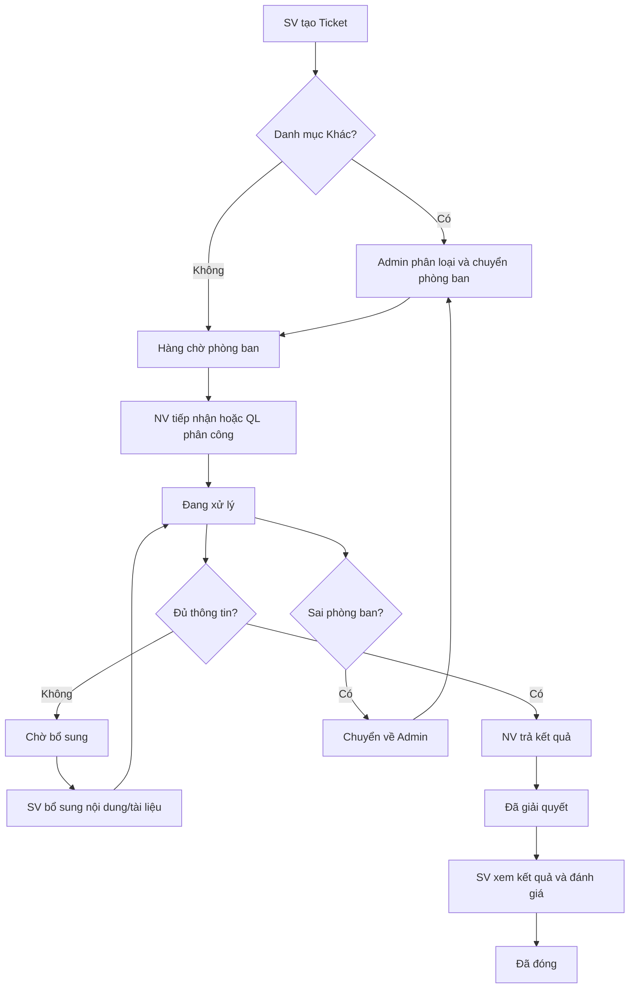

# 1. TỔNG QUAN VÒNG ĐỜI TICKET (LIFECYCLE OVERVIEW)

> **Mô hình tổng quan:** Quản lý vòng đời ticket từ lúc khởi tạo, phân loại, tiếp nhận, xử lý, bổ sung đến khi hoàn thành và đánh giá.

---

## 1.1. Sơ đồ Luồng Vòng đời Ticket (Mermaid Diagram)

---

## 1.2. Danh mục Trạng thái Ticket

| Trạng thái | Ý nghĩa | Thao tác chuyển đến | Ánh xạ Module |
|---|---|---|---|
| **Chưa tiếp nhận** | Ticket mới được tạo, chưa có người nhận | Sinh viên gửi Ticket hoặc Ticket được điều chuyển về hàng chờ | [M05-khoi-tao-ticket](../modules/GĐ1-NenTang&ChucNangCotLoi/M05-khoi-tao-ticket/) |
| **Đang xử lý** | Nhân viên đã tiếp nhận hoặc đang xử lý công việc | Nhân viên bấm nhận việc, quản lý phân công, hoặc Sinh viên bổ sung thông tin | [M06-tiep-nhan-ticket](../modules/GĐ1-NenTang&ChucNangCotLoi/M06-tiep-nhan-ticket/), [M07-xu-ly-trao-doi](../modules/GĐ1-NenTang&ChucNangCotLoi/M07-xu-ly-trao-doi/) |
| **Chờ bổ sung** | Đang chờ Sinh viên cung cấp thêm dữ liệu | Nhân viên gửi yêu cầu bổ sung thông tin (Pending 72h) | [M07-xu-ly-trao-doi](../modules/GĐ1-NenTang&ChucNangCotLoi/M07-xu-ly-trao-doi/), [M09](../modules/GĐ2-PhanHeSinhVien/M09-theo-doi-bo-sung/) |
| **Đã giải quyết** | Nhân viên đã gửi kết quả xử lý | Nhân viên trả kết quả thành công | [M08-tra-ket-qua](../modules/GĐ1-NenTang&ChucNangCotLoi/M08-tra-ket-qua/) |
| **Đã đóng** | Khóa Ticket vĩnh viễn, kết thúc vòng đời | Sinh viên đánh giá xong hoặc quá 72h không đánh giá | [M10-ket-qua-danh-gia](../modules/GĐ2-PhanHeSinhVien/M10-ket-qua-danh-gia/) |

---

## 1.3. Nguyên tắc Nghiệp vụ Chung

1. Mọi thao tác cập nhật Ticket phải kiểm tra đăng nhập và phân quyền ở Backend (RBAC).
2. Lưu lịch sử thay đổi trạng thái (Audit Trail), người thao tác, thời gian, nội dung và thông tin chuyển tiếp.
3. Tệp đính kèm phải kiểm tra định dạng, dung lượng tối đa và kiểm soát quyền truy cập file.
4. Không tạo Ticket mới khi bổ sung thông tin hoặc chuyển phòng ban (giữ nguyên mã Ticket duy nhất).
5. Kiểm soát truy cập đồng thời (Concurrency Control): Khi 2 nhân viên bấm tiếp nhận cùng lúc, hệ thống chặn việc nhận trùng.
