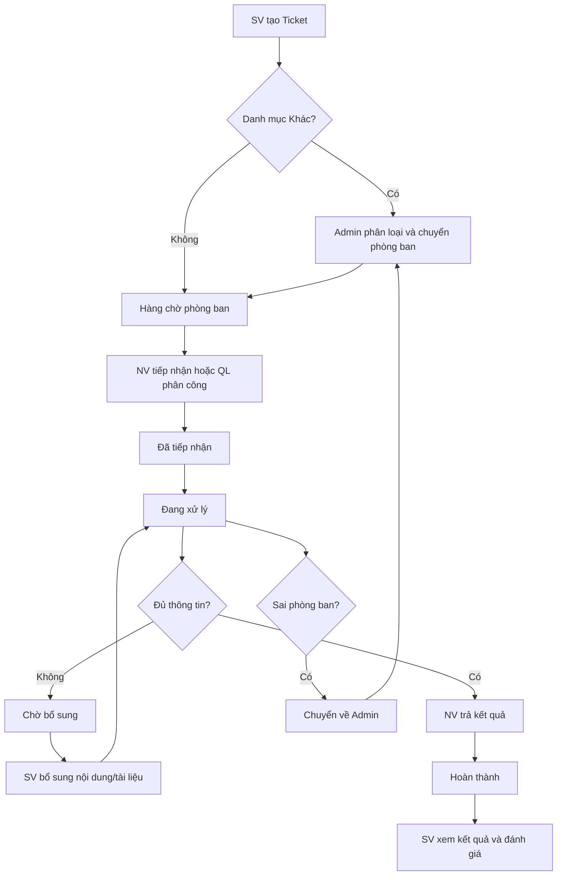

# 1. TỔNG QUAN VÒNG ĐỜI TICKET (LIFECYCLE OVERVIEW)

> **Mô hình tổng quan:** Quản lý vòng đời ticket từ lúc khởi tạo, phân loại, tiếp nhận, xử lý, bổ sung đến khi hoàn thành và đánh giá.

---

## 1.1. Sơ đồ Luồng Vòng đời Ticket (Mermaid Diagram)

---

## 1.2. Danh mục Trạng thái Ticket

| Trạng thái | Ý nghĩa | Thao tác chuyển đến | Ánh xạ Module |
|---|---|---|---|
| **Chưa tiếp nhận** | Ticket mới được tạo, chưa có người nhận | Sinh viên gửi Ticket hoặc Ticket được điều chuyển về hàng chờ | [M05-khoi-tao-ticket](../modules/Giai-Doan-1-Nen-Tang-Working-MVP/M05-khoi-tao-ticket/) |
| **Đã tiếp nhận** | Có Nhân viên phụ trách | Nhân viên bấm nhận Ticket (Claim) hoặc Quản lý phân công | [M06-tiep-nhan-ticket](../modules/Giai-Doan-1-Nen-Tang-Working-MVP/M06-tiep-nhan-ticket/) |
| **Đang xử lý** | Nhân viên đang thực hiện công việc | Nhân viên bắt đầu xử lý; Sinh viên bổ sung thông tin thành công | [M07-xu-ly-trao-doi](../modules/Giai-Doan-1-Nen-Tang-Working-MVP/M07-xu-ly-trao-doi/) |
| **Chờ bổ sung** | Đang chờ Sinh viên cung cấp thêm dữ liệu | Nhân viên gửi yêu cầu bổ sung thông tin (Pending 72h) | [M07-xu-ly-trao-doi](../modules/Giai-Doan-1-Nen-Tang-Working-MVP/M07-xu-ly-trao-doi/), [M09](../modules/Giai-Doan-2-Phan-He-Sinh-Vien/M09-theo-doi-bo-sung/) |
| **Hoàn thành** | Nhân viên đã gửi kết quả xử lý | Nhân viên trả kết quả thành công | [M08-tra-ket-qua](../modules/Giai-Doan-1-Nen-Tang-Working-MVP/M08-tra-ket-qua/) |

---

## 1.3. Nguyên tắc Nghiệp vụ Chung

1. Mọi thao tác cập nhật Ticket phải kiểm tra đăng nhập và phân quyền ở Backend (RBAC).
2. Lưu lịch sử thay đổi trạng thái (Audit Trail), người thao tác, thời gian, nội dung và thông tin chuyển tiếp.
3. Tệp đính kèm phải kiểm tra định dạng, dung lượng tối đa và kiểm soát quyền truy cập file.
4. Không tạo Ticket mới khi bổ sung thông tin hoặc chuyển phòng ban (giữ nguyên mã Ticket duy nhất).
5. Kiểm soát truy cập đồng thời (Concurrency Control): Khi 2 nhân viên bấm tiếp nhận cùng lúc, hệ thống chặn việc nhận trùng.
