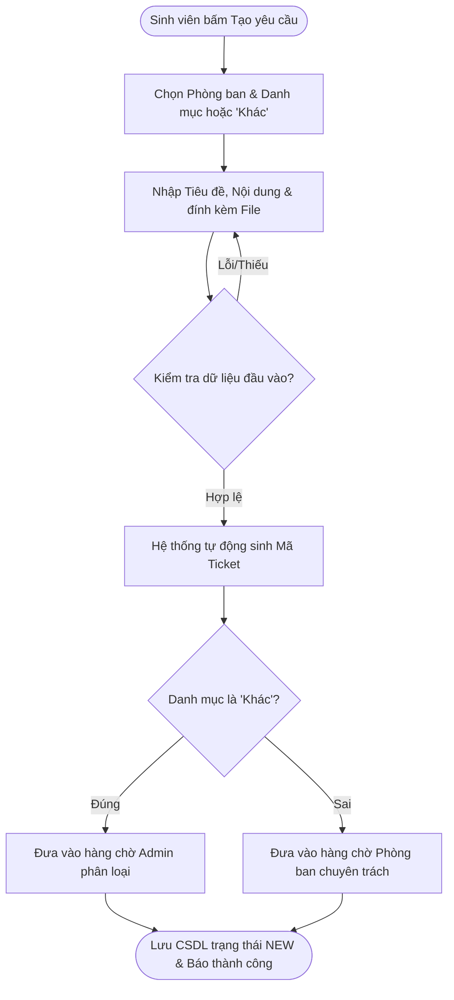
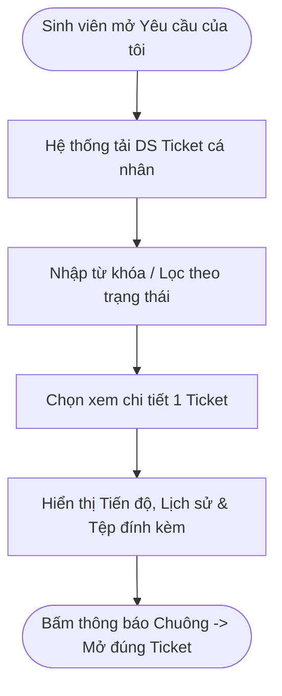
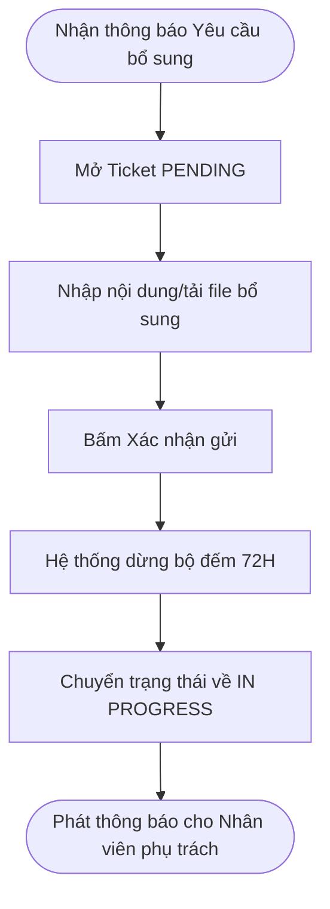
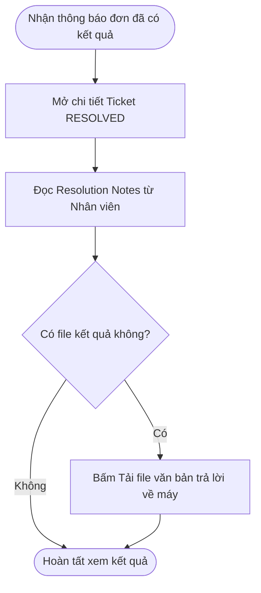
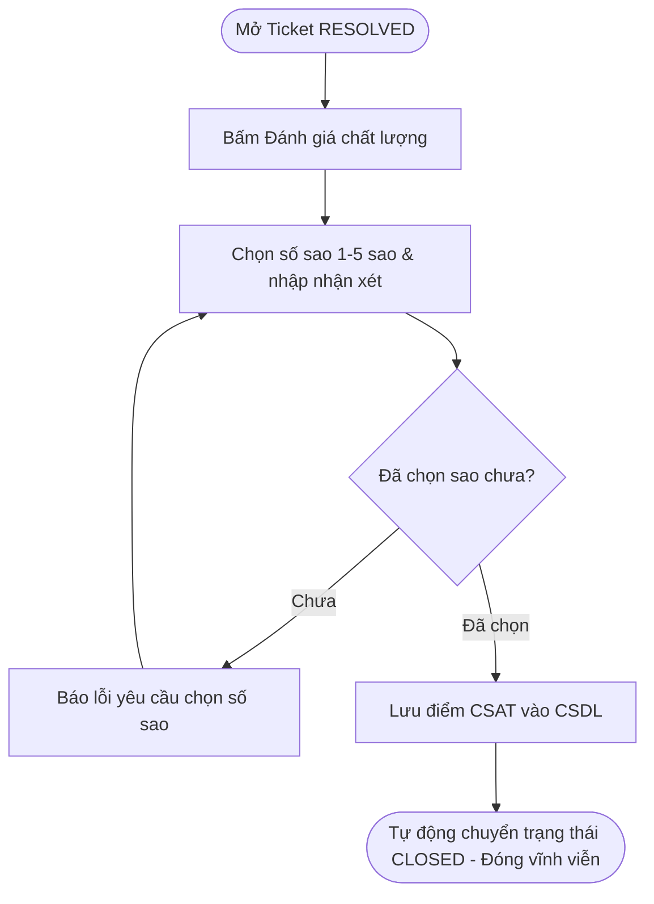

# 2. PHÂN HỆ SINH VIÊN (STUDENT WORKFLOWS)

> **Ánh xạ Phân hệ:** [M05-khoi-tao-ticket](../modules/Giai-Doan-1-Nen-Tang-Working-MVP/M05-khoi-tao-ticket/), [M09-theo-doi-bo-sung](../modules/Giai-Doan-2-Phan-He-Sinh-Vien/M09-theo-doi-bo-sung/), [M10-ket-qua-danh-gia](../modules/Giai-Doan-2-Phan-He-Sinh-Vien/M10-ket-qua-danh-gia/)

---

### SV-01 — Gửi yêu cầu hỗ trợ

* **Tác nhân:** Sinh viên.
* **Tiền điều kiện:** Đã đăng nhập; hệ thống có danh mục phòng ban hoạt động.
* **Ánh xạ Module:** [M05-khoi-tao-ticket](../modules/Giai-Doan-1-Nen-Tang-Working-MVP/M05-khoi-tao-ticket/) (`[FR-M05-01]`, `[FR-M05-02]`)
* **Luồng chính:**
  1. Chọn **Tạo yêu cầu**.
  2. Hệ thống hiển thị danh sách phòng ban và danh mục.
  3. Chọn phòng ban và danh mục tương ứng, hoặc **Khác**.
  4. Nhập tiêu đề, nội dung; đính kèm tài liệu nếu có (tối đa 5MB/file).
  5. Xem lại và xác nhận gửi.
  6. Hệ thống kiểm tra trường bắt buộc, danh mục và file đính kèm.
  7. Hệ thống sinh mã Ticket (VD: `IT-20261005-001`), lưu CSDL, ghi lịch sử, đặt trạng thái **Chưa tiếp nhận** (`New`).
  8. Nếu danh mục thông thường: đưa vào hàng chờ phòng ban. Nếu chọn **Khác**: đưa vào luồng Admin phân loại.
  9. Hiển thị mã Ticket và thông báo tạo thành công trên giao diện.
* **Ngoại lệ:** Thiếu dữ liệu/file không hợp lệ $\rightarrow$ hiển thị lỗi tại chỗ, giữ nguyên nội dung đã nhập; lưu CSDL thất bại $\rightarrow$ báo lỗi, không tạo trùng đơn.
* **Kết quả:** Ticket lưu thành công trong Database và xuất hiện trong danh sách Yêu cầu của Sinh viên.

---

### SV-02 — Theo dõi yêu cầu

* **Tác nhân:** Sinh viên.
* **Tiền điều kiện:** Sinh viên có Ticket đã khởi tạo.
* **Ánh xạ Module:** [M09-theo-doi-bo-sung](../modules/Giai-Doan-2-Phan-He-Sinh-Vien/M09-theo-doi-bo-sung/) (`[FR-M09-01]`, `[FR-M09-02]`)
* **Luồng chính:**
  1. Mở menu **Yêu cầu của tôi**.
  2. Hệ thống tải danh sách Ticket thuộc sở hữu của tài khoản hiện tại.
  3. Tìm kiếm, lọc theo trạng thái (`Chưa tiếp nhận`, `Đang xử lý`, `Chờ bổ sung`, `Hoàn thành`).
  4. Mở xem chi tiết: hiển thị mã Ticket, ngày tạo, phòng ban, danh mục, nội dung, tệp đính kèm và lịch sử xử lý.
  5. Nhận thông báo realtime/in-app khi trạng thái thay đổi; nhấn thông báo mở đúng Ticket tương ứng.
* **Ngoại lệ:** Truy cập Ticket không thuộc sở hữu $\rightarrow$ từ chối quyền; Ticket không tồn tại $\rightarrow$ báo lỗi.
* **Kết quả:** Sinh viên theo dõi minh bạch tiến độ giải quyết yêu cầu.

---

### SV-03 — Bổ sung thông tin

* **Tác nhân:** Sinh viên.
* **Tiền điều kiện:** Ticket đang ở trạng thái **Chờ bổ sung** (`Pending`).
* **Ánh xạ Module:** [M09-theo-doi-bo-sung](../modules/Giai-Doan-2-Phan-He-Sinh-Vien/M09-theo-doi-bo-sung/) (`[FR-M09-03]`, `[FR-M09-04]`)
* **Luồng chính:**
  1. Sinh viên nhận thông báo yêu cầu bổ sung từ Nhân viên.
  2. Mở Ticket, đọc nội dung yêu cầu cụ thể.
  3. Nhập văn bản bổ sung hoặc tải tệp minh chứng lên.
  4. Xác nhận gửi.
  5. Hệ thống kiểm tra hợp lệ, ghi nhận vào lịch sử Ticket hiện tại.
  6. Tự động chuyển trạng thái Ticket về **Đang xử lý** (`In Progress`).
  7. Giữ nguyên Nhân viên phụ trách cũ và tự động phát thông báo cho Nhân viên đó.
* **Ngoại lệ:** Ticket không còn ở trạng thái `Pending` $\rightarrow$ khóa form bổ sung; file lỗi $\rightarrow$ yêu cầu chọn lại file hợp lệ.
* **Kết quả:** Dữ liệu bổ sung được ghi nhận, luồng xử lý tiếp tục không tạo mới Ticket.

---

### SV-04 — Xem kết quả

* **Tác nhân:** Sinh viên.
* **Tiền điều kiện:** Ticket ở trạng thái **Hoàn thành** (`Resolved`).
* **Ánh xạ Module:** [M10-ket-qua-danh-gia](../modules/Giai-Doan-2-Phan-He-Sinh-Vien/M10-ket-qua-danh-gia/) (`[FR-M10-01]`)
* **Luồng chính:**
  1. Nhận thông báo có kết quả giải quyết từ hệ thống.
  2. Mở thông báo hoặc mở chi tiết Ticket từ danh sách.
  3. Hệ thống hiển thị nội dung giải trình kết quả (Resolution Notes) và file văn bản đính kèm từ Nhân viên.
  4. Sinh viên xem trực tiếp hoặc tải file kết quả về máy.
* **Ngoại lệ:** File kết quả bị lỗi hoặc không tồn tại $\rightarrow$ báo lỗi an toàn, không làm rò rỉ dữ liệu.
* **Kết quả:** Sinh viên nhận được kết quả giải quyết thủ tục hành chính.

---

### SV-05 — Đánh giá chất lượng

* **Tác nhân:** Sinh viên.
* **Tiền điều kiện:** Ticket ở trạng thái **Hoàn thành** (`Resolved`).
* **Ánh xạ Module:** [M10-ket-qua-danh-gia](../modules/Giai-Doan-2-Phan-He-Sinh-Vien/M10-ket-qua-danh-gia/) (`[FR-M10-02]`, `[FR-M10-03]`)
* **Luồng chính:**
  1. Mở Ticket đã hoàn thành và chọn **Đánh giá**.
  2. Giao diện hiển thị thang điểm 1–5 sao và ô nhập nhận xét/góp ý.
  3. Sinh viên chọn số sao, nhập nhận xét (tùy chọn) và nhấn Gửi.
  4. Hệ thống kiểm tra, lưu đánh giá gắn chặt với Ticket và Nhân viên xử lý.
  5. Tự động cập nhật trạng thái đơn thành `Closed` (Đóng vĩnh viễn).
* **Ngoại lệ:** Bỏ trống chưa chọn sao $\rightarrow$ yêu cầu chọn sao trước khi gửi; gửi trùng $\rightarrow$ chặn đánh giá lặp.
* **Kết quả:** Đánh giá CSAT được lưu trữ phục vụ báo cáo hiệu suất.

