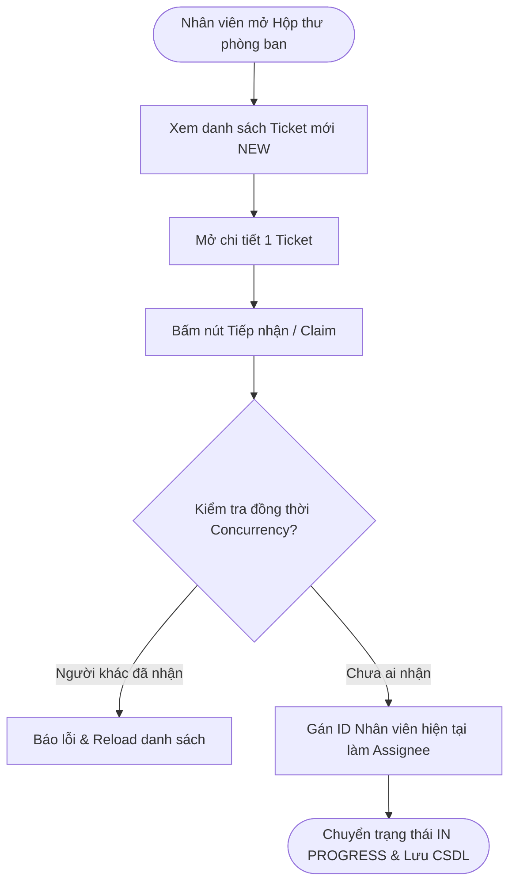
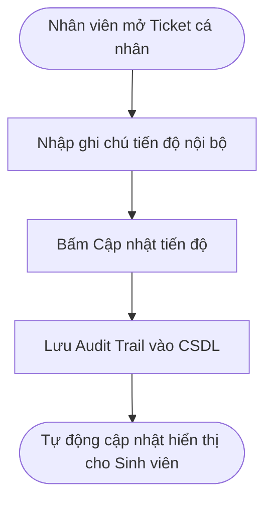
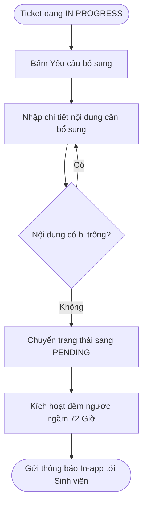
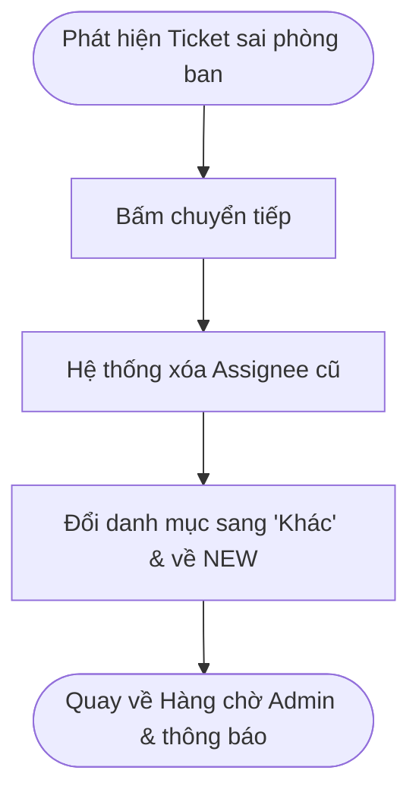
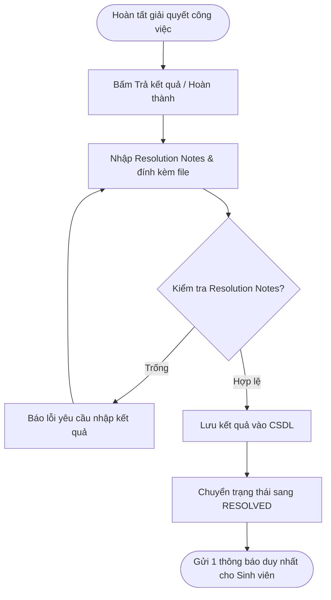
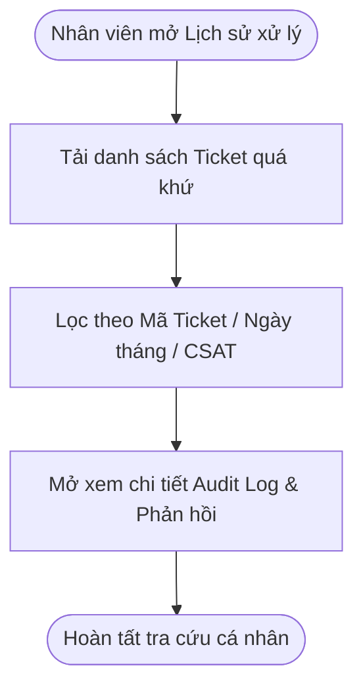

# 3. PHÂN HỆ NHÂN VIÊN (STAFF WORKFLOWS)

> **Ánh xạ Phân hệ:** [M06-tiep-nhan-ticket](../modules/GĐ1-NenTang&ChucNangCotLoi/M06-tiep-nhan-ticket/), [M07-xu-ly-trao-doi](../modules/GĐ1-NenTang&ChucNangCotLoi/M07-xu-ly-trao-doi/), [M08-tra-ket-qua](../modules/GĐ1-NenTang&ChucNangCotLoi/M08-tra-ket-qua/)

---

### NV-01 — Tiếp nhận Ticket

* **Tác nhân:** Nhân viên phòng ban.
* **Tiền điều kiện:** Đã đăng nhập tài khoản Role Nhân viên, thuộc phòng ban xử lý.
* **Ánh xạ Module:** [M06-tiep-nhan-ticket](../modules/GĐ1-NenTang&ChucNangCotLoi/M06-tiep-nhan-ticket/) (`[FR-M06-01]`, `[FR-M06-02]`)
* **Luồng chính:**
  1. Mở danh sách **Yêu cầu mới**.
  2. Hệ thống hiển thị danh sách Ticket ở trạng thái **Chưa tiếp nhận** (`New`) thuộc phòng ban.
  3. Tìm kiếm, lọc theo ngày tạo, độ ưu tiên; chọn mở xem chi tiết.
  4. Nhấn nút **Tiếp nhận** (`Claim`).
  5. Backend xác thực Ticket vẫn chưa có người nhận và chưa bị khóa.
  6. Gán ID Nhân viên hiện tại làm Assignee, chuyển trạng thái sang **Đã tiếp nhận / Đang xử lý**, ghi log lịch sử.
  7. Đưa Ticket vào danh sách làm việc cá nhân của Nhân viên.
* **Ngoại lệ:** Nhân viên khác vừa nhận trước $\rightarrow$ báo lỗi xung đột và tự động làm mới danh sách.
* **Kết quả:** Ticket có duy nhất 1 Nhân viên phụ trách.

---

### NV-02 — Cập nhật tiến độ

* **Tác nhân:** Nhân viên phụ trách Ticket.
* **Ánh xạ Module:** [M07-xu-ly-trao-doi](../modules/GĐ1-NenTang&ChucNangCotLoi/M07-xu-ly-trao-doi/) (`[FR-M07-01]`)
* **Luồng chính:**
  1. Mở Ticket đang phụ trách từ danh sách cá nhân.
  2. Chọn **Bắt đầu xử lý** $\rightarrow$ hệ thống gán trạng thái **Đang xử lý** (`In Progress`).
  3. Thực hiện công việc chuyên môn và ghi nhận tiến độ/ghi chú nội bộ.
  4. Hệ thống lưu lịch sử và cập nhật trạng thái hiển thị cho Sinh viên.
  5. Phát thông báo cho Sinh viên theo quy tắc thông báo tự động.
* **Ngoại lệ:** Người dùng không phải Assignee $\rightarrow$ từ chối thao tác.
* **Kết quả:** Tiến độ xử lý được cập nhật minh bạch và lưu truy vết.

---

### NV-03 — Yêu cầu bổ sung

* **Tác nhân:** Nhân viên phụ trách Ticket.
* **Ánh xạ Module:** [M07-xu-ly-trao-doi](../modules/GĐ1-NenTang&ChucNangCotLoi/M07-xu-ly-trao-doi/) (`[FR-M07-02]`)
* **Luồng chính:**
  1. Mở Ticket đang xử lý.
  2. Chọn tính năng **Yêu cầu bổ sung thông tin**.
  3. Nhập rõ nội dung thông tin/hồ sơ cần bổ sung, nhấn gửi.
  4. Hệ thống lưu nội dung yêu cầu, chuyển trạng thái sang **Chờ bổ sung** (`Pending`), kích hoạt đếm ngược 72 giờ.
  5. Sinh viên nhận được thông báo in-app và tiến hành bổ sung theo luồng `SV-03`.
  6. Khi Sinh viên bổ sung hợp lệ, Ticket tự động trở lại **Đang xử lý**, gửi thông báo cho Nhân viên cũ.
* **Ngoại lệ:** Nội dung bổ sung để trống $\rightarrow$ chặn gửi; Ticket đã đóng $\rightarrow$ không cho yêu cầu.
* **Kết quả:** Luồng bổ sung thông tin khép kín, không sinh thêm đơn mới.

---

### NV-04 — Chuyển Ticket sai phòng ban

* **Tác nhân:** Nhân viên phụ trách Ticket.
* **Ánh xạ Module:** [M07-xu-ly-trao-doi](../modules/GĐ1-NenTang&ChucNangCotLoi/M07-xu-ly-trao-doi/) (`[FR-M07-03]`)
* **Luồng chính:**
  1. Mở Ticket thuộc phạm vi xử lý.
  2. Xác định yêu cầu bị sai phòng ban chuyên trách.
  3. Chọn **Chuyển về Admin**, bắt buộc nhập lý do chuyển trả.
  4. Hệ thống làm trống Assignee, đổi danh mục thành "Khác", đưa về trạng thái **Chưa tiếp nhận** (`New`) và chuyển về hàng chờ Admin.
  5. Phát thông báo tự động cho Admin.
  6. Admin xem xét và thực hiện điều chuyển sang phòng ban phù hợp theo `AD-05`.
* **Ngoại lệ:** Không nhập lý do chuyển trả $\rightarrow$ hệ thống chặn thao tác.
* **Kết quả:** Ticket được luân chuyển lại đúng thẩm quyền mà không làm mất lịch sử ban đầu.

---

### NV-05 — Trả kết quả

* **Tác nhân:** Nhân viên phụ trách Ticket.
* **Ánh xạ Module:** [M08-tra-ket-qua](../modules/GĐ1-NenTang&ChucNangCotLoi/M08-tra-ket-qua/) (`[FR-M08-01]`, `[FR-M08-02]`)
* **Luồng chính:**
  1. Mở Ticket đang xử lý.
  2. Chọn **Trả kết quả**.
  3. Bắt buộc nhập nội dung giải trình kết quả (`Resolution Notes`), đính kèm văn bản/tài liệu trả lời (nếu có).
  4. Nhấn **Hoàn thành**.
  5. Hệ thống xác thực dữ liệu, lưu kết quả và đổi trạng thái sang **Hoàn thành** (`Resolved`).
  6. Ghi log lịch sử hoàn tất, tự động phát 1 thông báo kết quả cho Sinh viên xem.
* **Ngoại lệ:** Thiếu nội dung giải trình $
  ightarrow$ chặn hoàn thành; trạng thái đơn không hợp lệ $
  ightarrow$ báo lỗi.
* **Kết quả:** Ticket hoàn tất xử lý chuyên môn và sẵn sàng để Sinh viên nghiệm thu/đánh giá.

---

### NV-06 — Xem lịch sử xử lý

* **Tác nhân:** Nhân viên.
* **Ánh xạ Module:** [M07-xu-ly-trao-doi](../modules/GĐ1-NenTang&ChucNangCotLoi/M07-xu-ly-trao-doi/) (`[FR-M07-01]`)
* **Luồng chính:**
  1. Mở menu **Lịch sử xử lý**.
  2. Hệ thống tải danh sách các Ticket Nhân viên đã tiếp nhận hoặc giải quyết trong quá khứ.
  3. Tìm kiếm theo mã Ticket, tên Sinh viên, khoảng thời gian.
  4. Xem chi tiết nội dung, lịch sử luân chuyển và điểm đánh giá của Sinh viên (nếu có).
* **Kết quả:** Nhân viên tra cứu và quản lý lịch sử làm việc cá nhân.

