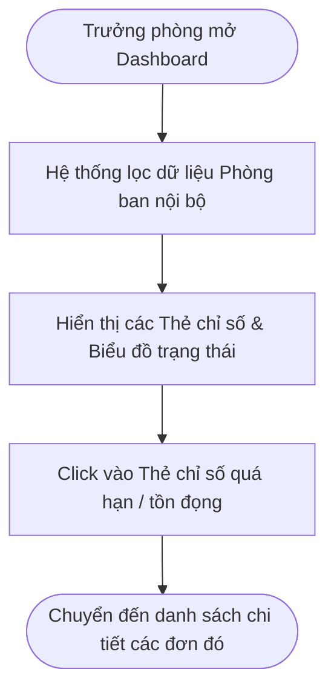
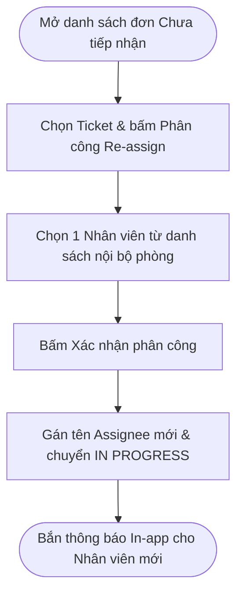
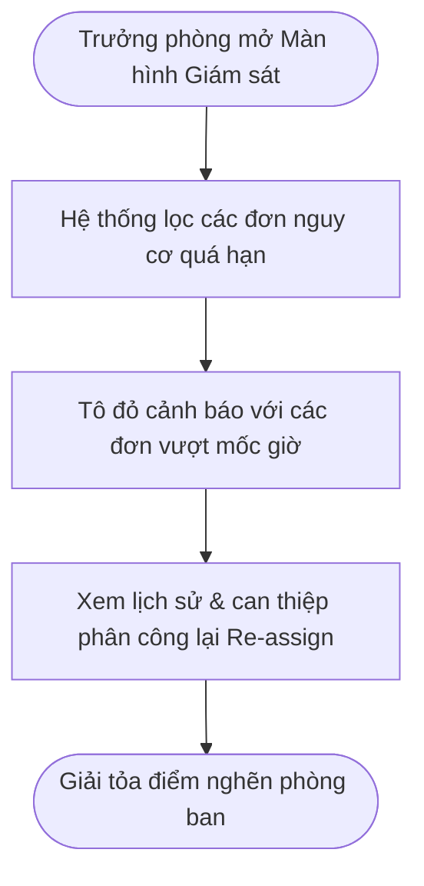
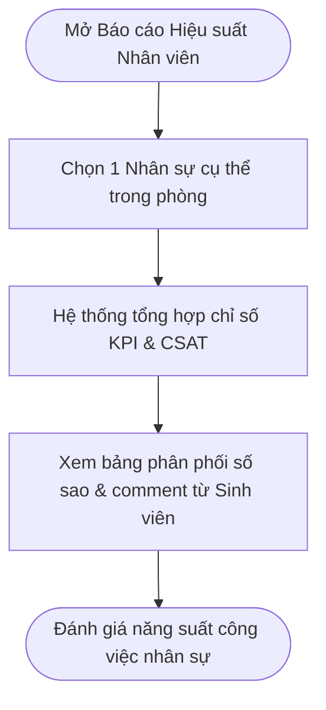
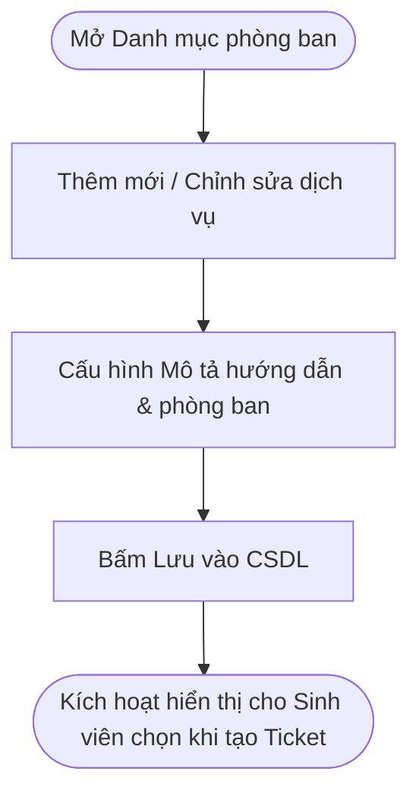
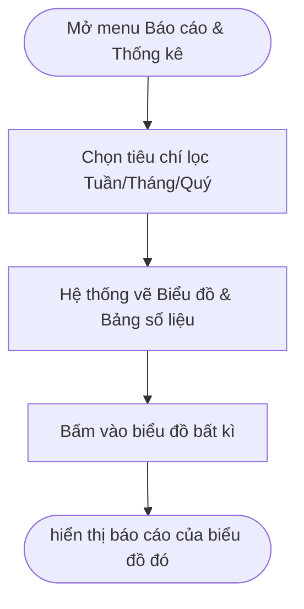

# 4. PHÂN HỆ QUẢN LÝ / TRƯỞNG PHÒNG (MANAGER WORKFLOWS)

> **Ánh xạ Phân hệ:** [M04-quan-ly-danh-muc](../modules/GĐ1-NenTang&ChucNangCotLoi/M04-quan-ly-danh-muc/), [M11-quan-ly-dieu-phoi](../modules/GĐ3-DieuPhoi&GIamSat/M11-quan-ly-dieu-phoi/), [M12-giam-sat-tien-do](../modules/GĐ3-DieuPhoi&GIamSat/M12-giam-sat-tien-do/), [M13-dashboard-bao-cao](../modules/GĐ3-DieuPhoi&GIamSat/M13-dashboard-bao-cao/)

---

### QL-01 — Theo dõi tổng quan phòng ban

* **Tác nhân:** Quản lý (Trưởng phòng/Phó phòng ban).
* **Ánh xạ Module:** [M13-dashboard-bao-cao](../modules/GĐ3-DieuPhoi&GIamSat/M13-dashboard-bao-cao/) (`[FR-M13-01]`)
* **Luồng chính:**
  1. Đăng nhập hệ thống, mở **Department Dashboard**.
  2. Hệ thống xác định phạm vi phòng ban trực thuộc của Quản lý.
  3. Thống kê tổng quan số liệu Ticket theo trạng thái (`Mới`, `Đang xử lý`, `Chờ bổ sung`, `Hoàn thành`), tỷ lệ quá hạn SLA.
  4. Nhấp vào các thẻ chỉ số để xem chi tiết danh sách đơn tương ứng.
* **Kết quả:** Quản lý nắm bắt trực quan tình hình hoạt động của phòng ban.

---

### QL-02 — Phân công nhanh

* **Tác nhân:** Quản lý phòng ban.
* **Ánh xạ Module:** [M11-quan-ly-dieu-phoi](../modules/GĐ3-DieuPhoi&GIamSat/M11-quan-ly-dieu-phoi/) (`[FR-M11-01]`)
* **Luồng chính:**
  1. Mở danh sách Ticket của phòng ban đang ở trạng thái `Chưa tiếp nhận`.
  2. Chọn Ticket cần điều phối, bấm **Phân công** (`Assign / Re-assign`).
  3. Giao diện hiển thị danh sách Nhân viên nội bộ phòng ban.
  4. Chọn Nhân viên phụ trách và nhấn Xác nhận.
  5. Backend kiểm tra quyền, gán tên Assignee, đổi trạng thái sang `In Progress` (nếu đơn mới), phát thông báo In-app cho Nhân viên được gán.
* **Ngoại lệ:** Chọn Nhân viên không thuộc phòng ban hoặc đơn vừa có người khác nhận $\rightarrow$ chặn thao tác.
* **Kết quả:** Phân bổ công việc chủ động cho nhân sự nội bộ.

---

### QL-03 — Giám sát tiến độ và tồn đọng

* **Tác nhân:** Quản lý phòng ban.
* **Ánh xạ Module:** [M12-giam-sat-tien-do](../modules/GĐ3-DieuPhoi&GIamSat/M12-giam-sat-tien-do/) (`[FR-M12-01]`, `[FR-M12-02]`)
* **Luồng chính:**
  1. Mở menu **Giám sát yêu cầu**.
  2. Hệ thống liệt kê danh sách đơn tồn đọng lâu ngày, đơn quá hạn SLA hoặc đơn kẹt ở trạng thái `Pending`.
  3. Lọc danh sách theo Nhân viên phụ trách, danh mục, thời gian.
  4. Mở xem chi tiết tiến độ xử lý và lịch sử trao đổi.
  5. Hệ thống hiển thị cảnh báo đỏ với các đơn vượt ngưỡng thời gian quy định.
* **Kết quả:** Kịp thời phát hiện các điểm nghẽn xử lý thủ tục hành chính.

---

### QL-04 — Theo dõi hiệu suất Nhân viên

* **Tác nhân:** Quản lý phòng ban.
* **Ánh xạ Module:** [M12-giam-sat-tien-do](../modules/GĐ3-DieuPhoi&GIamSat/M12-giam-sat-tien-do/) (`[FR-M12-01]`), [M13-dashboard-bao-cao](../modules/GĐ3-DieuPhoi&GIamSat/M13-dashboard-bao-cao/) (`[FR-M13-03]`)
* **Luồng chính:**
  1. Truy cập danh sách Nhân viên thuộc phòng ban.
  2. Chọn 1 Nhân viên cụ thể để xem báo cáo chi tiết.
  3. Hệ thống tổng hợp các chỉ số: số đơn đã nhận, số đơn hoàn thành, số đơn quá hạn, điểm CSAT trung bình.
  4. Xem danh sách chi tiết các đánh giá 1-5 sao và phản hồi từ Sinh viên đối với nhân sự đó.
* **Kết quả:** Có dữ liệu định lượng chính xác phục vụ đánh giá KPI nhân sự.

---

### QL-05 — Quản lý danh mục phòng ban

* **Tác nhân:** Quản lý phòng ban.
* **Ánh xạ Module:** [M04-quan-ly-danh-muc](../modules/GĐ1-NenTang&ChucNangCotLoi/M04-quan-ly-danh-muc/) (`[FR-M04-02]`)
* **Luồng chính:**
  1. Mở menu **Danh mục hỗ trợ phòng ban**.
  2. Hệ thống liệt kê danh mục dịch vụ hiện có của phòng ban.
  3. Thêm mới, chỉnh sửa thông tin hoặc ẩn/hiện danh mục dịch vụ.
  4. Nhập tiêu đề danh mục, mô tả và thời hạn tiêu chuẩn.
  5. Lưu thông tin vào CSDL.
  6. Các danh mục kích hoạt sẽ lập tức hiển thị cho Sinh viên chọn khi tạo đơn.
* **Kết quả:** Cấu hình linh hoạt các dịch vụ thuộc phạm vi quản lý của phòng ban.

---

### QL-06 — Báo cáo và đánh giá

* **Tác nhân:** Quản lý phòng ban.
* **Ánh xạ Module:** [M13-dashboard-bao-cao](../modules/GĐ3-DieuPhoi&GIamSat/M13-dashboard-bao-cao/) (`[FR-M13-02]`, `[FR-M13-03]`)
* **Luồng chính:**
  1. Mở menu **Báo cáo & Thống kê**.
  2. Thiết lập bộ lọc: Tuần/Tháng/Quý/Năm và loại danh mục.
  3. Hệ thống xuất biểu đồ trực quan, bảng phân tích lưu lượng đơn và bảng tổng hợp chỉ số CSAT.
  4. Chọn xuất dữ liệu ra tệp Excel hoặc PDF.
* **Kết quả:** Xuất báo cáo định kỳ phục vụ họp giao ban và cải tiến quy trình.

