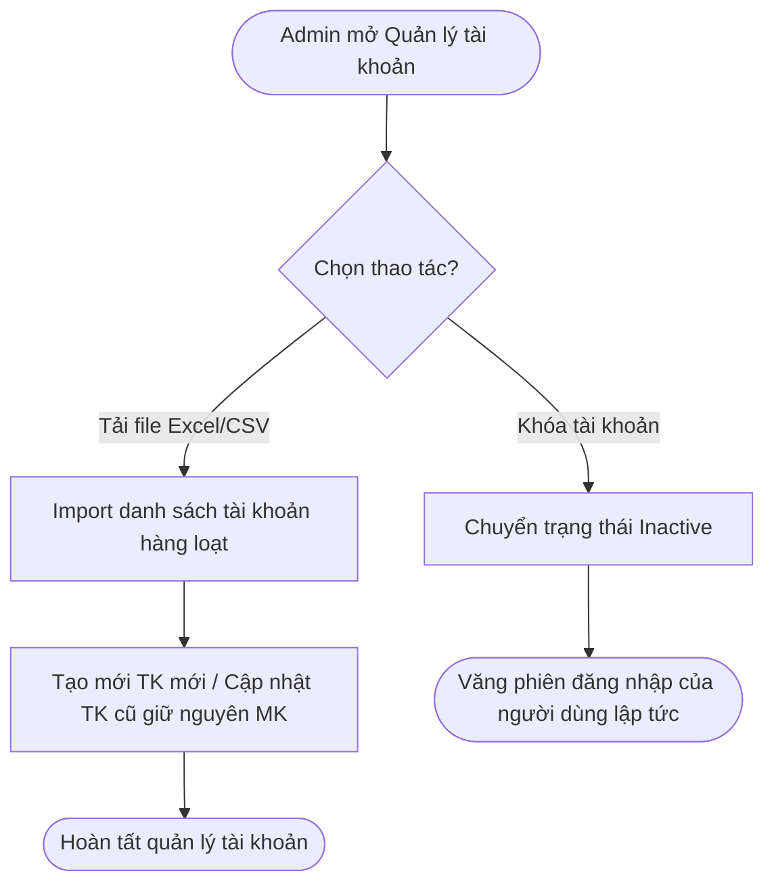
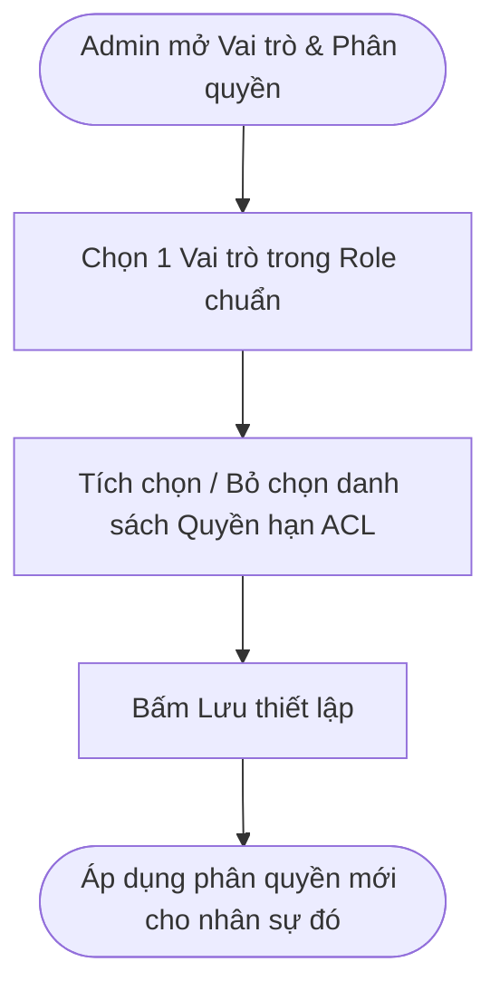
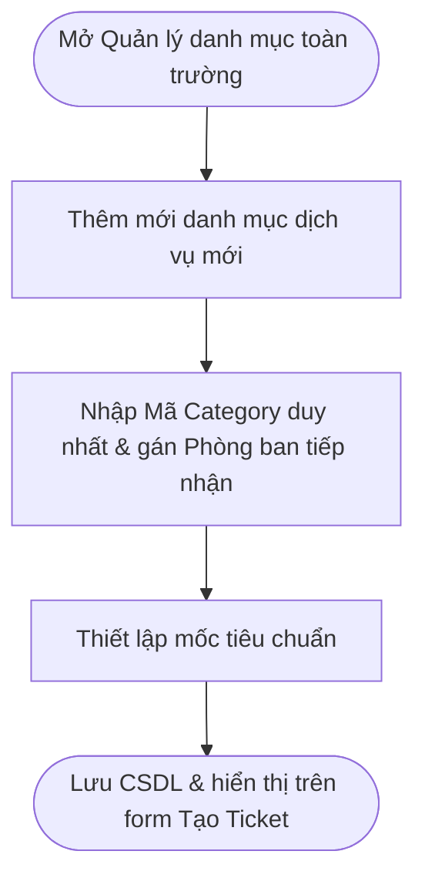
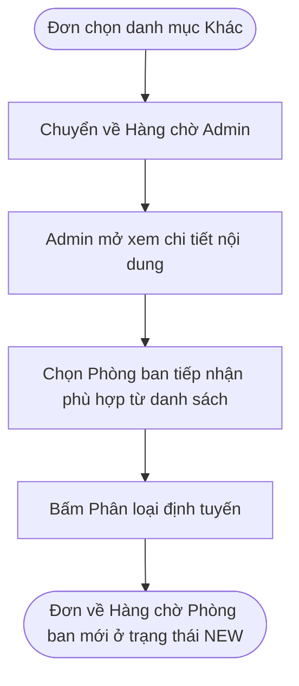
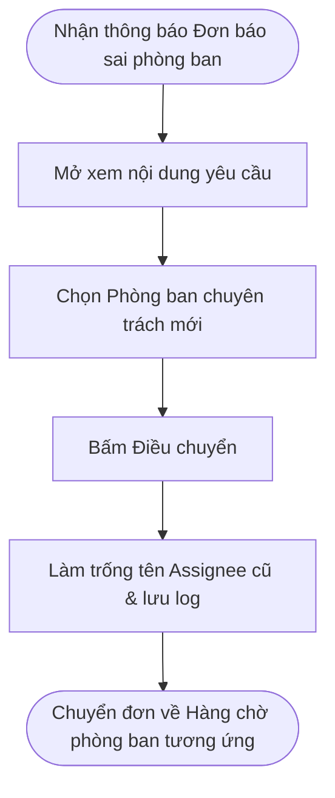
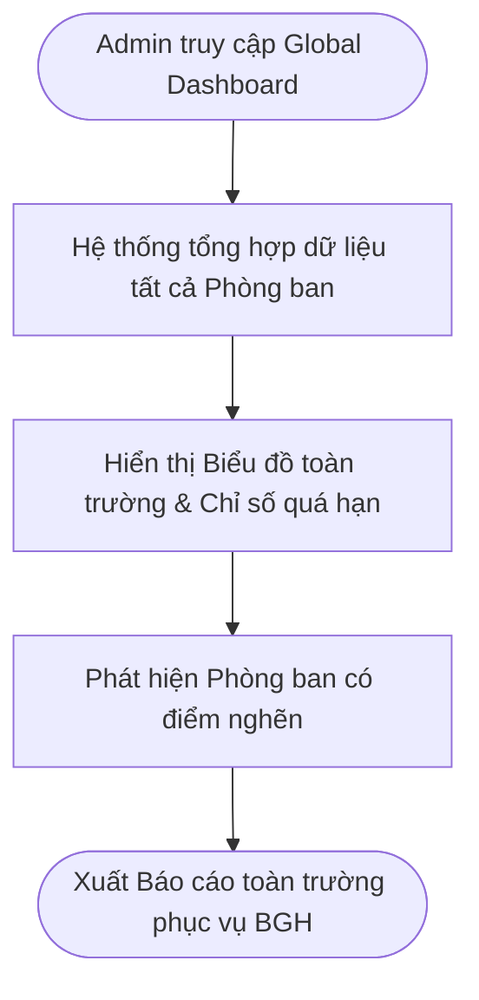

# 5. PHÂN HỆ QUẢN TRỊ VIÊN (ADMIN WORKFLOWS)

> **Ánh xạ Phân hệ:** [M02-account-management](../modules/Giai-Doan-1-Nen-Tang-Working-MVP/M02-account-management/), [M03-roles-permissions](../modules/Giai-Doan-1-Nen-Tang-Working-MVP/M03-roles-permissions/), [M04-category-management](../modules/Giai-Doan-1-Nen-Tang-Working-MVP/M04-category-management/), [M11-routing-dispatch](../modules/Giai-Doan-3-Dieu-Phoi-Giam-Sat/M11-routing-dispatch/), [M12-progress-monitoring](../modules/Giai-Doan-3-Dieu-Phoi-Giam-Sat/M12-progress-monitoring/), [M13-dashboard-reporting](../modules/Giai-Doan-3-Dieu-Phoi-Giam-Sat/M13-dashboard-reporting/)

---

### AD-01 — Quản lý tài khoản

* **Tác nhân:** Admin hệ thống.
* **Ánh xạ Module:** [M02-account-management](../modules/Giai-Doan-1-Nen-Tang-Working-MVP/M02-account-management/) (`[FR-M02-01]`, `[FR-M02-02]`)
* **Luồng chính:**
  1. Mở menu **Quản lý tài khoản**.
  2. Xem danh sách người dùng toàn trường; lọc theo Role, Phòng ban, Trạng thái.
  3. Thao tác: Tạo mới, Cập nhật thông tin, Khóa (`Inactive`), Mở khóa (`Active`) hoặc Import danh sách tài khoản từ file Excel/CSV.
  4. Khi import file Excel: Hệ thống kiểm tra cấu trúc file. Mã định danh mới $\rightarrow$ tạo mới với mật khẩu mặc định; Mã định danh cũ $\rightarrow$ cập nhật thông tin phòng ban, giữ nguyên mật khẩu cũ.
  5. Tài khoản bị chuyển `Inactive` lập tức bị đăng xuất khỏi hệ thống và bị văng phiên đăng nhập.
* **Kết quả:** Quản trị tập trung toàn bộ danh sách tài khoản người dùng.

---

### AD-02 — Vai trò và phân quyền

* **Tác nhân:** Admin hệ thống.
* **Ánh xạ Module:** [M03-roles-permissions](../modules/Giai-Doan-1-Nen-Tang-Working-MVP/M03-roles-permissions/) (`[FR-M03-01]`, `[FR-M03-02]`)
* **Luồng chính:**
  1. Mở menu **Vai trò & Phân quyền**.
  2. Hiển thị danh sách Vai trò (`Student`, `Staff`, `Manager`, `Admin`) và Ma trận quyền chi tiết (ACL).
  3. Chọn điều chỉnh danh sách quyền hạn gắn với từng Vai trò.
  4. Xác nhận lưu vào CSDL.
  5. Hệ thống áp dụng ma trận quyền mới ngay ở các phiên làm việc tiếp theo.
* **Kết quả:** Bảo mật hệ thống chặt chẽ theo nguyên tắc RBAC.

---

### AD-03 — Quản lý danh mục toàn trường

* **Tác nhân:** Admin hệ thống.
* **Ánh xạ Module:** [M04-category-management](../modules/Giai-Doan-1-Nen-Tang-Working-MVP/M04-category-management/) (`[FR-M04-01]`)
* **Luồng chính:**
  1. Mở menu **Quản lý danh mục toàn trường**.
  2. Xem cây danh mục hỗ trợ chia theo từng Phòng ban.
  3. Thêm mới danh mục toàn trường, sửa tên hoặc tạm ẩn danh mục cũ.
  4. Thiết lập phòng ban mặc định sẽ nhận đơn cho từng danh mục.
  5. Lưu thiết lập vào CSDL.
* **Kết quả:** Danh mục dịch vụ hành chính được tiêu chuẩn hóa toàn hệ thống.

---

### AD-04 — Phân loại Ticket "Khác"

* **Tác nhân:** Admin hệ thống.
* **Ánh xạ Module:** [M11-routing-dispatch](../modules/Giai-Doan-3-Dieu-Phoi-Giam-Sat/M11-routing-dispatch/) (`[FR-M11-02]`)
* **Luồng chính:**
  1. Sinh viên khởi tạo đơn chọn danh mục **Khác**.
  2. Hệ thống chuyển đơn về Hàng chờ phân loại của Admin.
  3. Admin mở xem nội dung chi tiết đơn yêu cầu của Sinh viên.
  4. Phân tích nội dung và chọn Phòng ban chuyên trách phù hợp từ danh sách.
  5. Xác nhận điều chuyển.
  6. Hệ thống cập nhật phòng ban, đưa đơn về Hàng chờ của phòng ban đó ở trạng thái `New`.
* **Kết quả:** Đơn không rõ danh mục được định tuyến chính xác.

---

### AD-05 — Điều chuyển Ticket sai phòng ban

* **Tác nhân:** Admin hệ thống.
* **Ánh xạ Module:** [M11-routing-dispatch](../modules/Giai-Doan-3-Dieu-Phoi-Giam-Sat/M11-routing-dispatch/) (`[FR-M11-03]`)
* **Luồng chính:**
  1. Nhân viên chuyển trả đơn sai phòng ban về cho Admin .
  2. Đơn xuất hiện trong danh sách **Đơn sai phòng ban chờ điều chuyển** của Admin.
  3. Admin xem lại nội dung.
  4. Chọn Phòng ban mới phù hợp hơn và bấm **Điều chuyển**.
  5. Hệ thống xóa Assignee cũ, cập nhật Phòng ban mới, giữ nguyên lịch sử cũ và đẩy đơn về Hàng chờ phòng ban mới.
* **Kết quả:** Giải quyết các sự cố định tuyến sai đơn giữa các phòng ban.

---

### AD-06 — Theo dõi và thống kê toàn trường

* **Tác nhân:** Admin hệ thống.
* **Ánh xạ Module:** [M12-progress-monitoring](../modules/Giai-Doan-3-Dieu-Phoi-Giam-Sat/M12-progress-monitoring/) (`[FR-M12-03]`), [M13-dashboard-reporting](../modules/Giai-Doan-3-Dieu-Phoi-Giam-Sat/M13-dashboard-reporting/) (`[FR-M13-01]`)
* **Luồng chính:**
  1. Truy cập **Global Dashboard**.
  2. Hệ thống tổng hợp dữ liệu Ticket trên quy mô toàn hệ thống trường.
  3. Hiển thị tổng số đơn, tỷ lệ hoàn thành, số đơn tồn đọng, danh sách phòng ban có tỷ lệ quá hạn cao.
  4. Xuất báo cáo tổng hợp toàn trường phục vụ Ban Giám hiệu.
* **Kết quả:** Giám sát toàn diện hoạt động hỗ trợ sinh viên của toàn trường.

