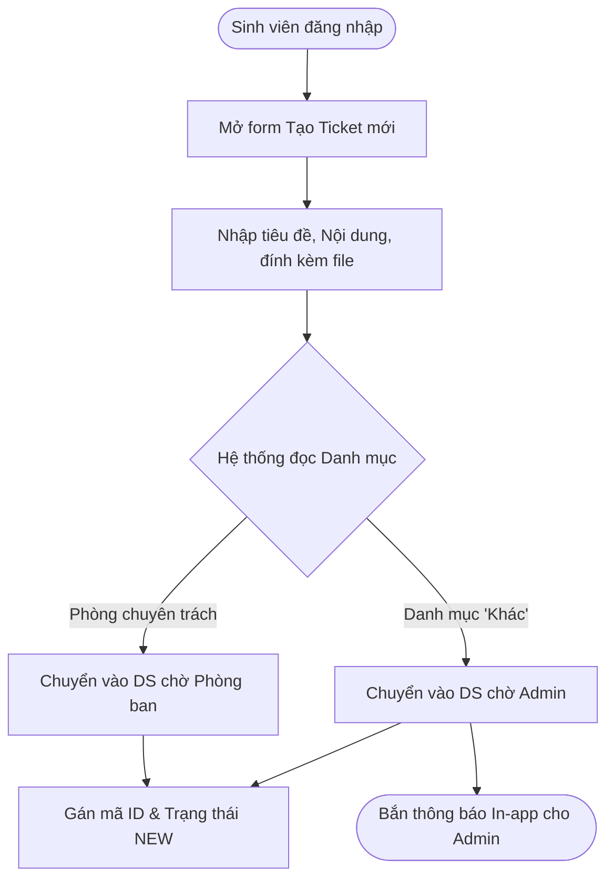

# WF-01: Luồng Khởi Tạo Yêu Cầu từ phía Sinh Viên (Submit Ticket)

## 1. Mô tả

Luồng ghi nhận toàn bộ hành trình sinh viên tạo một yêu cầu hỗ trợ mới cho đến khi đơn được khởi tạo và phân bổ thành công vào danh sách chờ của hệ thống.

---

## 2. Các bước thực hiện

1. **Đăng nhập & Khởi tạo:** Sinh viên đăng nhập vào hệ thống ([FR-AUTH-01]) và lựa chọn chức năng tạo mới yêu cầu hỗ trợ ([FR-REQ-01]).
2. **Nhập liệu & Đính kèm:** Sinh viên điền tiêu đề, lựa chọn danh mục, nhập nội dung yêu cầu chi tiết và đính kèm tài liệu/hình ảnh minh họa (dung lượng tối đa 5MB/file) nếu cần thiết ([FR-COM-03]). Sau đó bấm "Gửi yêu cầu".
3. **Sinh mã & Trạng thái:** Hệ thống tự động sinh mã định danh duy nhất cho đơn (VD: `IT-20261005-001`) ([FR-TKT-01]) và lưu trữ ticket khởi điểm ở trạng thái `New` ([FR-TKT-02]).
4. **Định tuyến tự động:** Hệ thống đọc dữ liệu trường danh mục để thực hiện định tuyến ([FR-ROUT-01]):
   * Nếu thuộc danh mục đã được cấu hình chuyên trách $\rightarrow$ Tự động phân bổ vào danh sách chờ của phòng ban tương ứng.
   * Nếu lựa chọn danh mục là "Khác" $\rightarrow$ Chuyển thẳng về danh sách chờ xử lý của Quản trị viên (Admin).
5. **Kích hoạt thông báo:** Hệ thống kiểm tra điều kiện phát thông báo ([FR-NOTI-01]): Trường hợp đơn thuộc danh mục "Khác", hệ thống tự động bắn cảnh báo in-app (hiển thị chấm đỏ ở biểu tượng quả chuông) cho Admin để tiến hành phân phối đơn.

---

## 3. Sơ đồ luồng quy trình (Mermaid Diagram)

