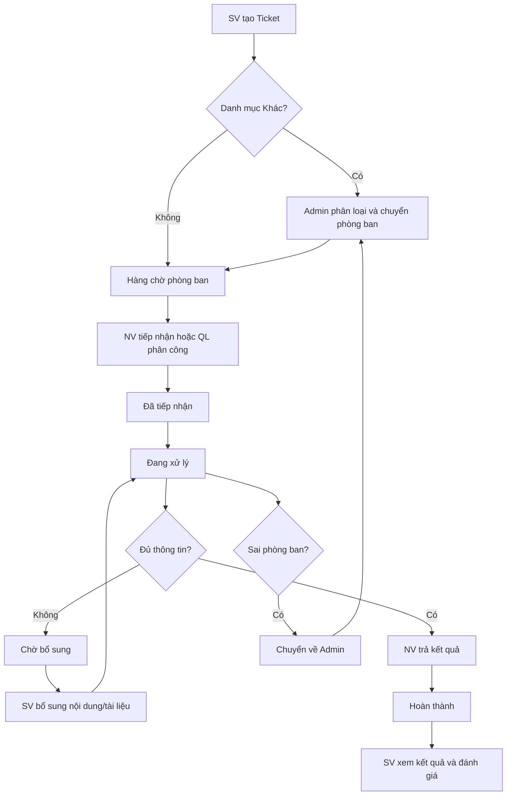

# UNISUPPORT — FUNCTIONAL WORKFLOWS (PRD)

> **Trạng thái tài liệu:** Bản nháp để chỉnh sửa trong Antigravity.  
> **Phạm vi:** Admin, Quản lý, Nhân viên, Sinh viên.  
> **Quy ước:** Những nội dung có nhãn **[CẦN CHỐT]** là quyết định nghiệp vụ chưa được xác nhận; không mặc định coi là yêu cầu đã duyệt.

## 1. Tổng quan vòng đời Ticket



### 1.1. Trạng thái Ticket

| Trạng thái | Ý nghĩa | Thao tác chuyển đến |
|---|---|---|
| Chưa tiếp nhận | Ticket mới được tạo, chưa có người nhận | Sinh viên gửi Ticket hoặc Ticket được điều chuyển về hàng chờ |
| Đã tiếp nhận | Có Nhân viên phụ trách | Nhân viên nhận Ticket |
| Đang xử lý | Nhân viên thực hiện xử lý | Nhân viên bắt đầu xử lý; Sinh viên bổ sung thành công |
| Chờ bổ sung | Đang chờ Sinh viên cung cấp thêm dữ liệu | Nhân viên yêu cầu bổ sung |
| Hoàn thành | Nhân viên đã gửi kết quả | Nhân viên trả kết quả |

> **[CẦN CHỐT]** Có cần trạng thái riêng `Chờ Admin phân loại`, `Chờ phân công`, `Đã đóng` hay không? Nếu có, cần thống nhất trước khi khóa thiết kế Database/API.

### 1.2. Nguyên tắc chung

- Mọi thao tác cập nhật Ticket phải kiểm tra đăng nhập và phạm vi quyền ở Backend.
- Lưu lịch sử thay đổi trạng thái, người thao tác, thời gian, nội dung và phòng ban/người phụ trách trước-sau khi chuyển.
- File đính kèm phải được kiểm tra định dạng, kích thước và quyền truy cập.
- Không tạo Ticket mới khi bổ sung thông tin hoặc chuyển phòng ban.
- Các thao tác đồng thời như hai Nhân viên cùng nhận Ticket phải được kiểm soát để tránh nhận trùng.

---

## 2. Sinh viên

### SV-01 — Gửi yêu cầu hỗ trợ
**Tác nhân:** Sinh viên.  
**Tiền điều kiện:** Đã đăng nhập; có phòng ban và danh mục hoạt động.

**Luồng chính**
1. Chọn **Tạo yêu cầu**.
2. Hệ thống hiển thị danh sách phòng ban.
3. Chọn phòng ban và danh mục tương ứng, hoặc **Khác**.
4. Nhập tiêu đề, nội dung; đính kèm tài liệu nếu có.
5. Xem lại và xác nhận gửi.
6. Hệ thống kiểm tra trường bắt buộc, danh mục và file.
7. Hệ thống sinh mã Ticket, lưu Database, ghi lịch sử, đặt **Chưa tiếp nhận**.
8. Nếu danh mục thông thường: đưa vào hàng chờ phòng ban. Nếu **Khác**: đưa vào luồng Admin phân loại theo quy tắc đã chốt.
9. Hiển thị mã Ticket và thông báo tạo thành công trên giao diện.

**Ngoại lệ:** Thiếu dữ liệu/file không hợp lệ → hiển thị lỗi, giữ nội dung đã nhập; lưu thất bại → không thông báo thành công và tránh tạo trùng khi gửi lại.

**Kết quả:** Ticket tồn tại trong Database và xuất hiện trong danh sách của Sinh viên.

### SV-02 — Theo dõi yêu cầu
**Tiền điều kiện:** Sinh viên có Ticket đã tạo.

1. Mở **Yêu cầu của tôi**.
2. Hệ thống chỉ tải Ticket thuộc tài khoản hiện tại.
3. Tìm kiếm, lọc theo trạng thái và chọn Ticket.
4. Hiển thị mã, ngày tạo, phòng ban, danh mục, nội dung, file, trạng thái và lịch sử xử lý.
5. Khi có thay đổi trạng thái, hiển thị thông báo; nhấn thông báo mở đúng Ticket.

**Ngoại lệ:** Ticket không thuộc người dùng → từ chối truy cập; Ticket không tồn tại → thông báo phù hợp.

**Kết quả:** Sinh viên theo dõi được tình trạng và tiến độ.

### SV-03 — Bổ sung thông tin
**Tiền điều kiện:** Ticket đang **Chờ bổ sung** và thuộc Sinh viên.

1. Sinh viên nhận thông báo yêu cầu bổ sung.
2. Mở Ticket, đọc nội dung Nhân viên yêu cầu.
3. Nhập thông tin bổ sung hoặc tải file lên.
4. Xác nhận gửi.
5. Hệ thống kiểm tra hợp lệ và lưu vào Ticket hiện tại.
6. Chuyển trạng thái về **Đang xử lý**.
7. Giữ đúng Nhân viên đã tiếp nhận và thông báo cho Nhân viên đó.

**Ngoại lệ:** Ticket không còn chờ bổ sung → không cho gửi theo luồng này; file lỗi → yêu cầu sửa.

**Kết quả:** Thông tin bổ sung và lịch sử được lưu, Nhân viên tiếp tục xử lý.

### SV-04 — Xem kết quả
**Tiền điều kiện:** Ticket **Hoàn thành**.

1. Hệ thống hiển thị thông báo có kết quả sau khi Nhân viên trả kết quả.
2. Sinh viên mở thông báo hoặc vào chi tiết Ticket.
3. Hệ thống hiển thị nội dung kết quả và file đính kèm.
4. Sinh viên xem/tải file được phép.

**Ngoại lệ:** File không tồn tại hoặc không có quyền → báo lỗi và không lộ tài liệu.

**Kết quả:** Sinh viên nhận được kết quả xử lý.

### SV-05 — Đánh giá chất lượng
**Tiền điều kiện:** Ticket **Hoàn thành**.

1. Mở Ticket đã hoàn thành và chọn **Đánh giá**.
2. Hệ thống hiển thị thang 1–5 sao và ô nhận xét.
3. Sinh viên chọn số sao, nhập nhận xét nếu muốn, nhấn gửi.
4. Hệ thống kiểm tra và lưu đánh giá gắn với Ticket và Nhân viên xử lý.
5. Quản lý xem được đánh giá trong phạm vi phòng ban.

**Ngoại lệ:** Chưa chọn sao → yêu cầu nhập; gửi đánh giá trùng → xử lý theo chính sách **[CẦN CHỐT]**.

**Kết quả:** Đánh giá được lưu để thống kê.

---

## 3. Nhân viên

### NV-01 — Tiếp nhận Ticket
**Tiền điều kiện:** Đã đăng nhập với Role Nhân viên và thuộc phòng ban.

1. Mở **Yêu cầu mới**.
2. Hệ thống hiển thị Ticket **Chưa tiếp nhận** thuộc phòng ban được phép.
3. Tìm kiếm/lọc, mở chi tiết.
4. Nhấn **Tiếp nhận**.
5. Backend kiểm tra Ticket vẫn có thể nhận và chưa có người phụ trách khác.
6. Gán Nhân viên hiện tại, chuyển **Đã tiếp nhận**, ghi lịch sử.
7. Hiển thị Ticket trong danh sách phụ trách.

**Ngoại lệ:** Người khác đã nhận → thông báo và tải lại dữ liệu; sai phòng ban → từ chối.

**Kết quả:** Ticket có người phụ trách duy nhất.

### NV-02 — Cập nhật tiến độ
1. Mở Ticket đang phụ trách.
2. Chọn **Bắt đầu xử lý** → hệ thống chuyển **Đang xử lý**.
3. Thực hiện công việc và cập nhật tiến độ/trạng thái hợp lệ.
4. Hệ thống lưu lịch sử và hiển thị trạng thái mới cho Sinh viên.
5. Khi thay đổi trạng thái, thông báo cho Sinh viên theo quy tắc thông báo đã chốt.

**Ngoại lệ:** Không phải người phụ trách hoặc chuyển trạng thái không hợp lệ → từ chối.

**Kết quả:** Tiến độ được ghi nhận và truy vết.

### NV-03 — Yêu cầu bổ sung
1. Mở Ticket đang xử lý.
2. Chọn **Yêu cầu bổ sung thông tin**.
3. Nhập nội dung cần bổ sung, xác nhận.
4. Hệ thống lưu yêu cầu và chuyển **Chờ bổ sung**.
5. Sinh viên nhìn thấy yêu cầu và bổ sung theo SV-03.
6. Khi bổ sung hợp lệ, Ticket trở về **Đang xử lý**, đúng Nhân viên cũ nhận thông báo.

**Ngoại lệ:** Nội dung yêu cầu trống → không gửi; Ticket đã hoàn thành → từ chối.

**Kết quả:** Quy trình bổ sung khép kín, không tạo Ticket mới.

### NV-04 — Chuyển Ticket sai phòng ban
1. Mở Ticket thuộc phạm vi phụ trách.
2. Xác định không thuộc phòng ban hiện tại.
3. Chọn **Chuyển về Admin**, nhập lý do.
4. Hệ thống ghi lịch sử và đưa vào danh sách Admin cần phân loại.
5. Hệ thống thông báo cho Admin.
6. Admin xem xét và chuyển Ticket sang phòng ban phù hợp theo AD-05.
7. Ticket xuất hiện trong hàng chờ của phòng ban mới.

**Ngoại lệ:** Không nhập lý do → từ chối; chuyển trùng → ngăn thao tác lặp.

**Kết quả:** Ticket được điều phối lại, giữ nguyên mã và lịch sử.

> **[CẦN CHỐT]** Quy tắc gỡ người phụ trách cũ, trạng thái trong thời gian chờ Admin và SLA khi chuyển phòng ban.

### NV-05 — Trả kết quả
1. Mở Ticket đang phụ trách.
2. Chọn **Trả kết quả**.
3. Nhập nội dung giải quyết, đính kèm tài liệu nếu có.
4. Nhấn **Hoàn thành**.
5. Hệ thống kiểm tra hợp lệ, lưu kết quả và chuyển **Hoàn thành**.
6. Ghi lịch sử, hiển thị trong danh sách đã xử lý.
7. Tạo **một** thông báo kết quả cho Sinh viên; SV-04 hiển thị chính thông báo này, không gửi trùng.

**Ngoại lệ:** Thiếu nội dung hoặc trạng thái không cho phép hoàn thành → báo lỗi.

**Kết quả:** Ticket hoàn thành và có kết quả để Sinh viên xem.

### NV-06 — Xem lịch sử xử lý
1. Mở **Lịch sử yêu cầu**.
2. Hệ thống tải Ticket đã tiếp nhận/xử lý theo quyền.
3. Tìm kiếm, lọc, mở chi tiết.
4. Xem mã, Sinh viên, trạng thái, kết quả, thời gian và lịch sử xử lý.

**Kết quả:** Nhân viên tra cứu được công việc của mình.

---

## 4. Quản lý

### QL-01 — Theo dõi tổng quan phòng ban
1. Đăng nhập, mở Dashboard.
2. Hệ thống xác định phòng ban được quản lý.
3. Tổng hợp Ticket theo trạng thái, quá hạn, tiến độ.
4. Chọn chỉ số để xem danh sách và chi tiết.

**Kết quả:** Có bức tranh tổng quan trong phạm vi phòng ban.

### QL-02 — Phân công nhanh
1. Mở danh sách Ticket của phòng ban.
2. Chọn Ticket, nhấn **Phân công nhanh**.
3. Hệ thống hiển thị Nhân viên thuộc phòng ban.
4. Chọn Nhân viên và xác nhận.
5. Hệ thống kiểm tra quyền, trạng thái và xung đột phân công.
6. Lưu người phụ trách, ghi lịch sử; Ticket xuất hiện ở danh sách Nhân viên.

**Ngoại lệ:** Nhân viên không thuộc phòng ban hoặc Ticket đã đổi người phụ trách → từ chối và yêu cầu tải lại.

**Kết quả:** Ticket được phân công đúng phạm vi.

### QL-03 — Giám sát tiến độ và tồn đọng
1. Mở **Giám sát yêu cầu**.
2. Xem Ticket chưa tiếp nhận, đang xử lý, chờ bổ sung và quá hạn.
3. Lọc theo Nhân viên, trạng thái, thời gian.
4. Mở chi tiết để xem hạn xử lý và lịch sử.
5. Hệ thống hiển thị cảnh báo quá hạn hoặc chưa phân công theo cấu hình.

**Kết quả:** Quản lý phát hiện yêu cầu tồn đọng.

### QL-04 — Theo dõi hiệu suất Nhân viên
1. Mở danh sách Nhân viên thuộc phòng ban.
2. Chọn Nhân viên.
3. Hệ thống tổng hợp Ticket đang xử lý, hoàn thành, quá hạn và đánh giá.
4. Xem Ticket liên quan và nhận xét Sinh viên.

**Kết quả:** Có dữ liệu đánh giá hiệu suất.

### QL-05 — Quản lý danh mục phòng ban
1. Mở **Danh mục hỗ trợ**.
2. Hệ thống chỉ hiển thị danh mục thuộc phòng ban được quản lý.
3. Tìm kiếm hoặc thêm danh mục.
4. Nhập thông tin và lưu.
5. Hệ thống kiểm tra quyền, trùng lặp và tính hợp lệ.
6. Danh mục hợp lệ xuất hiện cho Sinh viên khi tạo Ticket.

**Kết quả:** Danh mục phòng ban được cập nhật.

> **[CẦN CHỐT]** Danh mục Quản lý tạo có cần Admin duyệt không?

### QL-06 — Báo cáo và đánh giá
1. Mở **Báo cáo & Thống kê**.
2. Chọn thời gian và tiêu chí.
3. Hệ thống thống kê Ticket và rating trong phòng ban.
4. Hiển thị số liệu, biểu đồ, nhận xét và chi tiết theo quyền.

**Kết quả:** Báo cáo hỗ trợ đánh giá hoạt động phòng ban.

---

## 5. Admin

### AD-01 — Quản lý tài khoản
1. Mở **Quản lý tài khoản**.
2. Xem danh sách toàn trường; tìm kiếm/lọc theo phòng ban, ngành, trạng thái.
3. Chọn tạo, cập nhật, khóa, mở khóa hoặc xóa tài khoản.
4. Hệ thống kiểm tra quyền, dữ liệu và ràng buộc liên quan.
5. Lưu và cập nhật danh sách.
6. Tài khoản bị khóa không được tiếp tục truy cập theo chính sách xác thực.

**Ngoại lệ:** Dữ liệu trùng, tài khoản có ràng buộc hoặc thao tác trái quyền → báo lỗi.

**Kết quả:** Tài khoản được quản trị tập trung.

### AD-02 — Vai trò và phân quyền
1. Mở **Vai trò & Phân quyền**.
2. Xem các Role và danh sách quyền.
3. Chọn Role, thay đổi quyền được phép cấu hình.
4. Xác nhận lưu.
5. Backend kiểm tra cấu hình hợp lệ và lưu.
6. Những lần truy cập tiếp theo áp dụng quyền mới theo chính sách phiên.

**Ngoại lệ:** Cấu hình khiến mất quyền quản trị cuối cùng → chặn theo chính sách **[CẦN CHỐT]**.

**Kết quả:** Quyền truy cập được kiểm soát tập trung.

### AD-03 — Quản lý danh mục toàn trường
1. Mở **Danh mục hỗ trợ**.
2. Xem danh mục theo phòng ban.
3. Thêm hoặc tạm ngưng danh mục.
4. Nhập thông tin và xác định phòng ban.
5. Hệ thống kiểm tra hợp lệ, lưu thay đổi.
6. Danh mục hoạt động được hiển thị trong form tạo Ticket.

**Kết quả:** Danh mục hỗ trợ toàn trường nhất quán.

### AD-04 — Phân loại Ticket "Khác"
1. Sinh viên gửi Ticket thuộc danh mục **Khác**.
2. Hệ thống đưa Ticket vào danh sách Admin cần phân loại.
3. Admin xem chi tiết nội dung.
4. Xác định phòng ban phù hợp.
5. Chọn phòng ban và xác nhận.
6. Hệ thống lưu phòng ban, lịch sử điều phối.
7. Ticket chuyển đến hàng chờ phòng ban mới.

**Kết quả:** Ticket "Khác" được phân loại đúng bộ phận.

### AD-05 — Điều chuyển Ticket sai phòng ban
1. Nhân viên chuyển Ticket về Admin kèm lý do.
2. Hệ thống đưa Ticket vào hàng chờ điều chuyển và thông báo Admin.
3. Admin xem nội dung, lý do và lịch sử.
4. Chọn phòng ban phù hợp, xác nhận.
5. Hệ thống cập nhật phòng ban, xử lý phân công cũ theo quy tắc, ghi lịch sử.
6. Ticket xuất hiện trong hàng chờ phòng ban mới.

**Kết quả:** Ticket được điều chuyển mà không mất dữ liệu.

### AD-06 — Theo dõi và thống kê toàn trường
1. Mở Dashboard.
2. Hệ thống tổng hợp Ticket trên toàn trường.
3. Hiển thị tổng số, trạng thái, tồn đọng và quá hạn.
4. Lọc theo phòng ban, danh mục, thời gian.
5. Chọn số liệu để xem danh sách, chi tiết và báo cáo.

**Kết quả:** Admin giám sát được tình hình toàn hệ thống.

---

## 6. Ma trận thông báo — Giới hạn 6 hành vi đã thống nhất

| # | Sự kiện/hiển thị | Người nhận | Module liên quan | Quy tắc |
|---|---|---|---|---|
| 1 | Trạng thái Ticket thay đổi | Sinh viên | M09 / NV-02 | Nhấn thông báo mở đúng Ticket |
| 2 | Sinh viên gửi bổ sung | Nhân viên đang phụ trách | M09 / SV-03 | Không đổi người phụ trách |
| 3 | Hiển thị thông báo có kết quả | Sinh viên | M10 / SV-04 | Mở được kết quả |
| 4 | Nhân viên trả kết quả | Sinh viên | M13 / NV-05 | Là **cùng sự kiện** với #3, không gửi hai lần |
| 5 | Nhân viên chuyển Ticket sai phòng ban | Admin | NV-04 / AD-05 | Thông báo cho Admin, không phải Quản lý |
| 6 | Ticket quá hạn hoặc chưa phân công | Quản lý (theo phạm vi) | QL-03 | Hiển thị cảnh báo theo cấu hình |

> Bảng mô tả **6 hành vi**; #3 và #4 dùng chung một sự kiện kết quả, không tạo thông báo trùng. Các thông báo khác không tự ý bổ sung nếu chưa được duyệt.

---

## 7. Các quyết định nghiệp vụ cần chốt trước khi phát triển

| Mã | Vấn đề | Phương án cần xác nhận |
|---|---|---|
| BR-01 | Danh mục "Khác" | Luôn về Admin hay chỉ khi chưa xác định được phòng ban? |
| BR-02 | Nhận Ticket | Cho Nhân viên tự nhận, Quản lý phân công, hay cả hai? |
| BR-03 | Hoàn thành/đóng Ticket | Nhân viên trả kết quả là Hoàn thành hay cần Sinh viên xác nhận đóng? |
| BR-04 | Đánh giá | Một lần hay được sửa? Có bắt buộc đánh giá không? |
| BR-05 | Điều chuyển phòng ban | Gỡ người phụ trách cũ, trạng thái chờ và SLA thế nào? |
| BR-06 | Danh mục do Quản lý thêm | Có cần Admin duyệt? |
| BR-07 | SLA | Tính từ lúc tạo, phân công hay tiếp nhận? Tạm dừng khi chờ bổ sung không? |
| BR-08 | Phân quyền động | Những quyền nào Admin được cấu hình; khi đổi quyền phiên hiện tại xử lý ra sao? |
| BR-09 | File đính kèm | Dung lượng, định dạng, số lượng, thời gian lưu? |
| BR-10 | Xóa tài khoản | Xóa mềm hay xóa cứng để bảo toàn lịch sử Ticket? |

## 8. Mẫu dùng khi thêm workflow mới

```markdown
### [MÃ] — [TÊN CHỨC NĂNG]
**Tác nhân:** ...
**Tiền điều kiện:** ...

**Luồng chính**
1. Người dùng ...
2. Hệ thống ...

**Luồng ngoại lệ**
- Nếu ... thì ...

**Kết quả:** ...
**Trạng thái trước → sau:** ...
**Quy tắc nghiệp vụ:** ...
**Tiêu chí nghiệm thu:** ...
```
